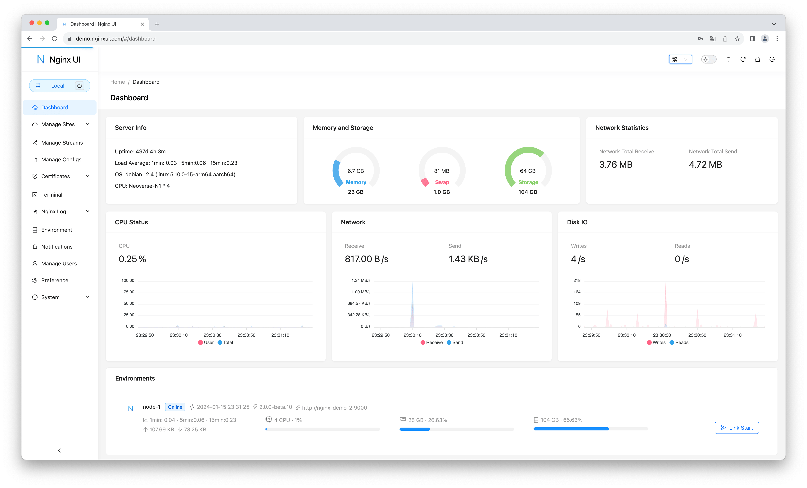

<div align="center">
      
</div>

# Nginx UI

Yet another Nginx Web UI

Nginx 網路管理介面，由 [0xJacky](https://jackyu.cn/) 與 [Hintay](https://blog.kugeek.com/) 開發。

[](https://github.com/0xJacky/nginx-ui/actions/workflows/build.yml)

[English](README.md) | [Español](README-es.md) | [简体中文](README-zh_CN.md) | 繁體中文

<details>
  <summary>目錄</summary>
  <ol>
    <li>
      <a href="#關於專案">關於專案</a>
      <ul>
        <li><a href="#線上預覽">線上預覽</a></li>
        <li><a href="#特色">特色</a></li>
        <li><a href="#國際化">國際化</a></li>
        <li><a href="#建置基於">建置基於</a></li>
      </ul>
    </li>
    <li>
      <a href="#入門指南">入門指南</a>
      <ul>
        <li><a href="#使用前注意">使用前注意</a></li>
        <li><a href="#安裝">安裝</a></li>
        <li>
          <a href="#使用方法">使用方法</a>
          <ul>
            <li><a href="#透過執行檔案執行">透過執行檔案執行</a></li>
            <li><a href="#使用-systemd">使用 Systemd</a></li>
            <li><a href="#使用-docker">使用 Docker</a></li>
          </ul>
        </li>
      </ul>
    </li>
    <li>
      <a href="#手動建置">手動建置</a>
      <ul>
        <li><a href="#相依性">相依性</a></li>
        <li><a href="#建置前端">建置前端</a></li>
        <li><a href="#建置後端">建置後端</a></li>
      </ul>
    </li>
    <li>
      <a href="#linux-安裝指令">Linux 安裝指令</a>
      <ul>
        <li><a href="#基本用法">基本用法</a></li>
        <li><a href="#更多用法">更多用法</a></li>
      </ul>
    </li>
    <li><a href="#nginx-反向代理設定範例">Nginx 反向代理設定範例</a></li>
    <li><a href="#貢獻">貢獻</a></li>
    <li><a href="#開源軟體授權條款">開源軟體授權條款</a></li>
  </ol>
</details>


## 關於專案



### 線上預覽

網址：[https://demo.nginxui.com](https://demo.nginxui.com)

- 使用者：admin
- 密碼：admin

### 特色

- 線上檢視伺服器 CPU、記憶體、系統負載、磁碟使用率等指標
- 線上 ChatGPT 助理
- 一鍵申請和自動續簽 Let's encrypt 憑證
- 線上編輯 Nginx 設定檔，編輯器支援 Nginx 設定語法醒目提示
- 線上檢視 Nginx 日誌
- 使用 Go 和 Vue 開發，發行版本為單個可執行檔案
- 儲存設定後自動測試設定檔並重新載入 Nginx
- 基於網頁瀏覽器的高階命令列終端
- 支援暗黑模式
- 自適應網頁設計

### 國際化

- 英語
- 簡體中文
- 繁體中文

我們歡迎您將專案翻譯成任何語言。

### 建置基於

- [The Go Programming Language](https://go.dev)
- [Gin Web Framework](https://gin-gonic.com)
- [GORM](http://gorm.io)
- [Vue 3](https://v3.vuejs.org)
- [Vite](https://vitejs.dev)
- [TypeScript](https://www.typescriptlang.org/)
- [Ant Design Vue](https://antdv.com)
- [vue3-gettext](https://github.com/jshmrtn/vue3-gettext)
- [vue3-ace-editor](https://github.com/CarterLi/vue3-ace-editor)
- [Gonginx](https://github.com/tufanbarisyildirim/gonginx)
- [lego](https://github.com/go-acme/lego)

## 入門指南

### 使用前注意

Nginx UI 遵循 Debian 的網頁伺服器設定檔標準。建立的網站設定檔將會放置於 Nginx 設定資料夾（自動檢測）下的 `sites-available` 中，啟用後的網站將會建立一份設定檔軟連結檔到 `sites-enabled` 資料夾。您可能需要提前調整設定檔的組織方式。

對於非 Debian (及 Ubuntu) 作業系統，您可能需要將 `nginx.conf` 設定檔中的內容修改為如下所示的 Debian 風格。

```nginx
http {
	# ...
	include /etc/nginx/conf.d/*.conf;
	include /etc/nginx/sites-enabled/*;
}
```

更多資訊請參閱：[debian/conf/nginx.conf](https://salsa.debian.org/nginx-team/nginx/-/blob/master/debian/conf/nginx.conf#L59-L60)

### 安裝

Nginx UI 可在以下作業系統中使用：

- macOS 11 Big Sur 及之後版本（amd64 / arm64）
- Linux 2.6.23 及之後版本（x86 / amd64 / arm64 / armv5 / armv6 / armv7 / mips32 / mips64 / riscv64 / loongarch64）
  - 包括但不限於 Debian 7 / 8、Ubuntu 12.04 / 14.04 及後續版本、CentOS 6 / 7、Arch Linux
- FreeBSD
- OpenBSD
- Dragonfly BSD
- Openwrt

您可以在 [最新釋出 (latest release)](https://github.com/0xJacky/nginx-ui/releases/latest) 中下載最新版本，或使用 [Linux 安裝指令](#linux-安裝指令)。

### 使用方法

第一次執行 Nginx UI 時，請在網頁瀏覽器中訪問 `http://<your_server_ip>:<listen_port>` 完成後續設定。

#### 透過執行檔案執行

**在終端中執行 Nginx UI**

```shell
nginx-ui -config app.ini
```
在終端使用 `Control+C` 退出 Nginx UI。

**在背景執行 Nginx UI**

```shell
nohup ./nginx-ui -config app.ini &
```

使用以下命令停止 Nginx UI。

```shell
kill -9 $(ps -aux | grep nginx-ui | grep -v grep | awk '{print $2}')
```

#### 使用 Systemd

如果你使用的是 [Linux 安裝指令](#linux-安裝指令)，Nginx UI 將作為 `nginx-ui` 守護行程安裝在 systemd 中。請使用 `systemctl` 指令控制。

**啟動 Nginx UI**

```shell
systemctl start nginx-ui
```

**停止 Nginx UI**

```shell
systemctl stop nginx-ui
```

**重啟 Nginx UI**

```shell
systemctl restart nginx-ui
```

#### 使用 Docker

您可以在 docker 中使用我們提供的 `uozi/nginx-ui:latest`  [映象](https://hub.docker.com/r/uozi/nginx-ui)，此映象基於 `nginx:latest` 建置。您可以直接將其監聽到 80 和 443 埠以取代宿主機上的 Nginx。

注意：對映到 `/etc/nginx` 的資料夾應是一個空資料夾。

**Docker 範例**

```bash
docker run -dit \
  --name=nginx-ui \
  --restart=always \
  -e TZ=Asia/Shanghai \
  -v /mnt/user/appdata/nginx:/etc/nginx \
  -v /mnt/user/appdata/nginx-ui:/etc/nginx-ui \
  -p 8080:80 -p 8443:443 \
  uozi/nginx-ui:latest
```

## 手動建置

對於沒有官方建置版本的作業系統，可以嘗試手動建置。

### 相依性

- Make

- Golang 1.23+

- node.js 21+

  ```shell
  npx browserslist@latest --update-db
  ```

### 建置前端

請在 `app` 資料夾中執行以下命令。

```shell
pnpm install
pnpm build
```

### 建置後端

請先完成前端編譯，再回到專案的根目錄執行以下命令。

```shell
go build -tags=jsoniter -ldflags "$LD_FLAGS -X 'github.com/0xJacky/Nginx-UI/settings.buildTime=$(date +%s)'" -o nginx-ui -v main.go
```

## Linux 安裝指令

### 基本用法

**安裝或升級**

```shell
bash -c "$(curl -L https://raw.githubusercontent.com/0xJacky/nginx-ui/main/install.sh)" @ install
```

一鍵安裝指令預設的監聽連接埠為 `9000`，HTTP Challenge 埠預設為 `9180`，如果出現連接埠衝突請修改 `/usr/local/etc/nginx-ui/app.ini`，並使用 `systemctl restart nginx-ui` 重啟 Nginx UI 守護行程。

**解除安裝 Nginx UI 但保留設定和資料庫檔案**

```shell
bash -c "$(curl -L https://raw.githubusercontent.com/0xJacky/nginx-ui/main/install.sh)" @ remove
```

### 更多用法

````shell
bash -c "$(curl -L https://raw.githubusercontent.com/0xJacky/nginx-ui/main/install.sh)" @ help
````

## Nginx 反向代理設定範例

```nginx
server {
    listen          80;
    listen          [::]:80;

    server_name     <your_server_name>;
    rewrite ^(.*)$  https://$host$1 permanent;
}

map $http_upgrade $connection_upgrade {
    default upgrade;
    ''      close;
}

server {
    listen  443       ssl;
    listen  [::]:443  ssl;
    http2   on;

    server_name         <your_server_name>;

    ssl_certificate     /path/to/ssl_cert;
    ssl_certificate_key /path/to/ssl_cert_key;

    location / {
        proxy_set_header    Host                $host;
        proxy_set_header    X-Real-IP           $remote_addr;
        proxy_set_header    X-Forwarded-For     $proxy_add_x_forwarded_for;
        proxy_set_header    X-Forwarded-Proto   $scheme;
        proxy_http_version  1.1;
        proxy_set_header    Upgrade             $http_upgrade;
        proxy_set_header    Connection          $connection_upgrade;
        proxy_pass          http://127.0.0.1:9000/;
    }
}
```

## 貢獻

貢獻使開源社群成為學習、啟發和創造的絕佳場所。我們**非常感謝**您所做的任何貢獻。

如果您有讓這個專案變得更強的建議，歡迎 fork 這個程式庫 (repository) 並建立一個 Pull Request。您也可以建立一個帶有 `enhancement` （加強）標籤的 Issue。最後，不要忘記給我們的專案點個 Star！再次感謝！

1. Fork 專案
2. 建立您的分支 (`git checkout -b feature/AmazingFeature`)
3. 提交您的修改 (`git commit -m 'Add some AmazingFeature'`)
4. 推送到您的分支 (`git push origin feature/AmazingFeature`)
5. 建立一個 Pull Request

## 開源軟體授權條款

此專案基於 GNU Affero Public License v3.0 (AGPLv3) 授權條款，請參閱 [LICENSE](LICENSE) 檔案。透過使用、散佈或對本專案做出貢獻，表明您已同意本授權條款的條款和條件。
