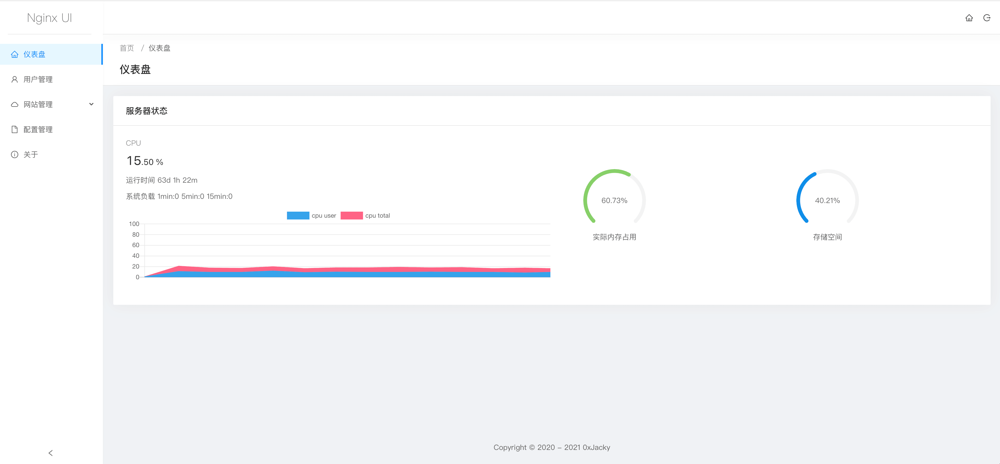

<div align="center">
      
</div>

# Nginx UI

Yet another Nginx Web UI, developed by [0xJacky](https://jackyu.cn/) and [Hintay](https://blog.kugeek.com/).

[](https://github.com/0xJacky/nginx-ui/actions/workflows/build.yml)

[简体中文说明](README-zh_CN.md)

<details>
  <summary>Table of Contents</summary>
  <ol>
    <li>
      <a href="#about-the-project">About The Project</a>
      <ul>
        <li><a href="#features">Features</a></li>
        <li><a href="#built-with">Internationalization</a></li>
        <li><a href="#built-with">Built With</a></li>
      </ul>
    </li>
    <li>
      <a href="#getting-started">Getting Started</a>
      <ul>
        <li><a href="#before-use">Before Use</a></li>
        <li><a href="#installation">Installation</a></li>
        <li><a href="#usage">Usage</a></li>
      </ul>
    </li>
    <li>
      <a href="#manual-build">Manual Build</a>
      <ul>
        <li><a href="#prerequisites">Prerequisites</a></li>
        <li><a href="#build-frontend">Build Frontend</a></li>
        <li><a href="#build-backend">Build Backend</a></li>
      </ul>
    </li>
    <li>
      <a href="#scripts-for-linux">Scripts for Linux</a>
      <ul>
        <li><a href="#prerequisites">Basic Usage</a></li>
        <li><a href="#build-frontend">More Usage</a></li>
      </ul>
    </li>
    <li><a href="#example-of-nginx-reverse-proxy-configuration">Example of Nginx Reverse Proxy Configuration</a></li>
    <li><a href="#contributing">Contributing</a></li>
    <li><a href="#license">License</a></li>
  </ol>
</details>

## About The Project

[]()

### Features

- Online view of server CPU, Memory, Load Average, Disk Usage and other indicators.
- One-click deployment and automatic renewal Let's Encrypt certificates.
- Online editing websites configuration files, the editor support highlight nginx configuration syntax.
- Written in Go and Vue, distribution is a single executable binary.

### Internationalization

- English
- Simplified Chinese
- Traditional Chinese

We welcome translations into any language.

### Built With

- [The Go Programming Language](https://go.dev/)
- [Gin Web Framework](https://gin-gonic.com)
- [GORM](http://gorm.io/index.html)
- [Vue 2](https://vuejs.org)
- [vue-gettext](https://github.com/Polyconseil/vue-gettext)

## Getting Started

### Before Use

The Nginx UI follows the Nginx standard of creating site configuration files in the `sites-available` directory under
the Nginx configuration directory (auto-detected). The configuration files for an enabled site will create a soft link
to the `sites-enabled` directory. Therefore, you may need to adjust the way the configuration files are organised.

### Installation

Nginx UI is available on the following platforms:

- Mac OS X 10.10 Yosemite and later (amd64 / arm64)
- Linux 2.6.23 and later (x86 / amd64 / arm64)
  - Including but not limited to Debian 7 / 8, Ubuntu 12.04 / 14.04 and later, CentOS 6 / 7, Arch Linux
- FreeBSD (x86 / amd64)
- OpenBSD (x86 / amd64)
- Dragonfly BSD (amd64)

You can visit [latest release](https://github.com/0xJacky/nginx-ui/releases/latest) to download the latest distribution, or just use [installation scripts for Linux](#scripts-for-linux).

### Usage

#### Manually Install
- Start Nginx UI in foreground
```shell
nginx-ui --config app.ini
```
- Kill Nginx UI in foreground
    - Keyboard shortcuts `Ctrl+C`

- Start Nginx UI in background
```shell
nohup ./nginx-ui --config app.ini &
```
- Kill Nginx UI in background
```shell
jobs
kill %job_id
```
#### Installed by script
- Start Nginx UI
```shell
systemctl start nginx-ui
```
- Stop Nginx UI
```shell
systemctl stop nginx-ui
```
- Restart Nginx UI
```shell
systemctl restart nginx-ui
```
## Manual Build

On platforms where installation scripts are not supported, they can be built manually.

### Prerequisites

- Make

- Golang 1.17+

- node.js 14+

  ```shell
  npx browserslist@latest --update-db
  ```

### Build Frontend

Please execute the following command in `frontend` directory.

```shell
yarn install
make translations
yarn build
```

### Build Backend

Please build the frontend first, and then execute the following command in the project root directory.

```shell
go build -o nginx-ui -v main.go
```

## Scripts for Linux

### Basic Usage

**Install and Upgrade**

```shell
bash <(curl -L -s https://raw.githubusercontent.com/0xJacky/nginx-ui/master/install.sh) @ install
```
The default listening port is 9000, and the default HTTP Challenge port is 9180. If there is a port conflict, please modify `/usr/local/etc/nginx-ui/app.ini` manually, then use `systemctl restart nginx-ui` to reload the Nginx UI service.

Once the nginx-ui is running, please visit `http://<your_server_ip>:<listen_port>/install`
in your browser to complete the follow-up configurations.

**Remove Nginx UI, except configuration and database files**

```shell
bash <(curl -L -s https://raw.githubusercontent.com/0xJacky/nginx-ui/master/install.sh) @ remove
```

### More Usage

````shell
bash <(curl -L -s https://raw.githubusercontent.com/0xJacky/nginx-ui/master/install.sh) @ help
````

## Example of Nginx Reverse Proxy Configuration

```nginx
server {
    listen	80;
    listen	[::]:80;

    server_name	<your_server_name>;
    rewrite ^(.*)$  https://$host$1 permanent;
}

server {
    listen	443 ssl http2;
    listen	[::]:443 ssl http2;

    server_name	<your_server_name>;

    ssl_certificate	/path/to/ssl_cert;
    ssl_certificate_key	/path/to/ssl_cert_key;

    location / {
        proxy_set_header Host $host;
        proxy_set_header   X-Real-IP            $remote_addr;
        proxy_set_header   X-Forwarded-For      $proxy_add_x_forwarded_for;
        proxy_set_header   X-Forwarded-Proto    $scheme;
        proxy_http_version 1.1;
        proxy_set_header Upgrade $http_upgrade;
        proxy_set_header Connection upgrade;
        proxy_pass http://127.0.0.1:9000/;
    }
}
```

## Contributing

Contributions are what make the open source community such an amazing place to learn, inspire, and create. Any contributions you  make are **greatly appreciated**.

If you have a suggestion that would make this better,  please fork the repo and create a pull request. You can also simply open an issue with the tag "enhancement". Don't forget to give the project a star! Thanks again!

1. Fork the Project
2. Create your Feature Branch (`git checkout -b feature/AmazingFeature`)
3. Commit your Changes (`git commit -m 'Add some AmazingFeature'`)
4. Push to the Branch (`git push origin feature/AmazingFeature`)
5. Open a Pull Request

## License

This project is provided under a GNU Affero General Public License v3.0 license that can be found in the [LICENSE](LICENSE) file. By using, distributing, or contributing to this project, you agree to the terms and conditions of this license.
