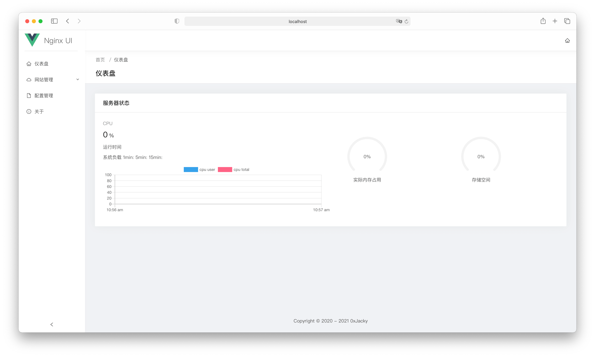
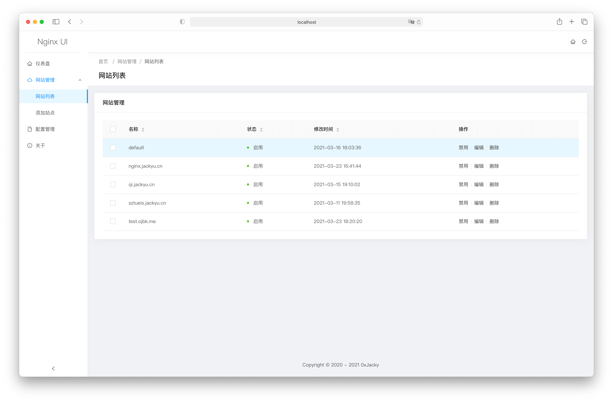
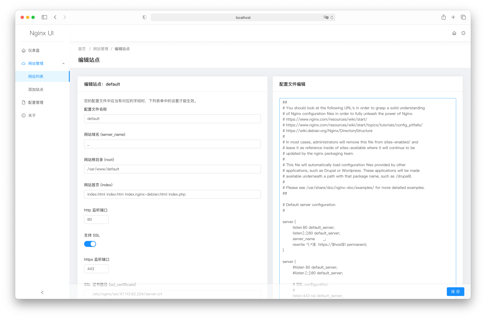
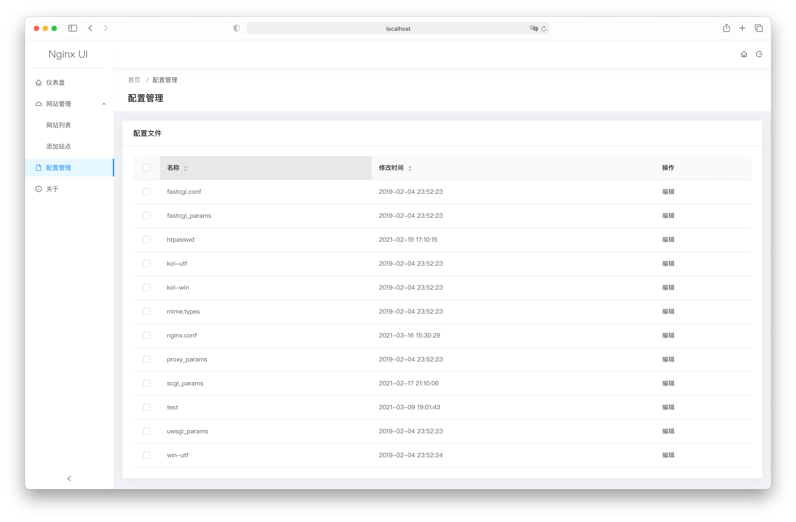
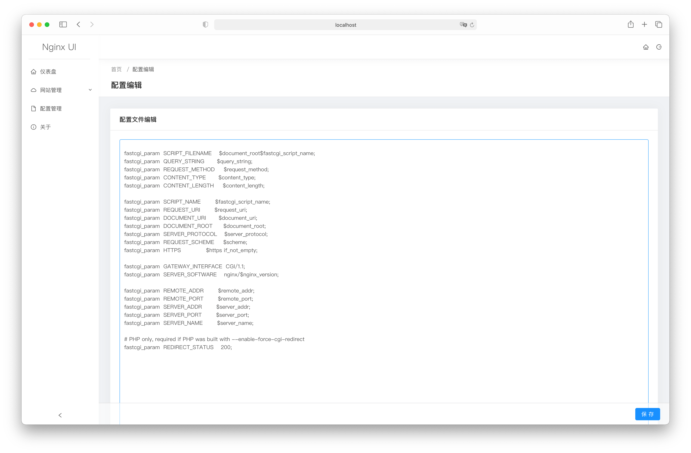

# Nginx UI
Yet another Nginx Web UI

Version: 1.0.0

## 项目特色

1. 可在线查看服务器 CPU、内存、load average、磁盘使用率等指标
2. 可一键申请 Let's encrypt 证书
3. 在线编辑网站配置文件

## 项目预览

### 登录


### 仪表盘


### 用户列表


### 域名列表


### 域名编辑


### 配置列表


### 配置编辑


## 使用前注意

Nginx UI 遵循 Nginx 的标准，创建的网站配置文件位于 Nginx 配置目录（自动检测）下的 `sites-available` 目录，
启用后的网站的配置文件将会创建一份软连接到 `sites-enabled` 目录中。因此，您可能需要调整配置文件的组织方式。

## 安装
1. 克隆项目
```
git clone https://github.com/0xJacky/nginx-ui
```
2. 编译后端
```
cd server
go build -o nginx-ui-server main.go
```
3. 启动后端
    1. 前台启动 `./nginx-ui-server`
    2. 后台启动 `nohup ./nginx-ui-server &`

4. 添加配置文件到 nginx
```
server {
    listen	80;
    listen	[::]:80;

    server_name	<your_server_name>;
    rewrite ^(.*)$  https://$host$1 permanent;
}

server {
    listen	443 ssl http2;
    listen	[::]:443 ssl http2;

    server_name	<your_server_name>;

    ssl_certificate	/path/to/ssl_cert;
    ssl_certificate_key	/path/to/ssl_cert_key;

    root	/path/to/nginx-ui-frontend/dist;

    index	index.html;

    location /api/ {
        proxy_set_header Host $host;
        proxy_set_header X-Real_IP $remote_addr;
        proxy_set_header X-Forwarded-For $remote_addr:$remote_port;
        proxy_http_version 1.1;
        proxy_set_header Upgrade $http_upgrade;
        proxy_set_header Connection upgrade;
        proxy_pass http://127.0.0.1:9000/;
    }
}
```

4. 初始化系统

在浏览器中访问 `https://<your_server_name>/install`

输入用户名和密码创建初始账户。
