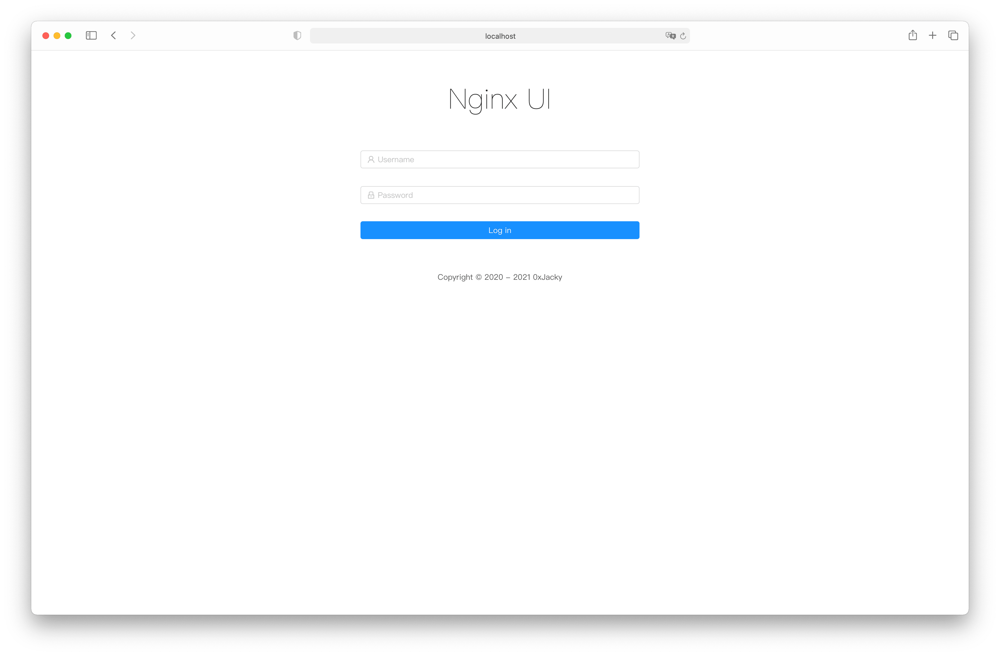
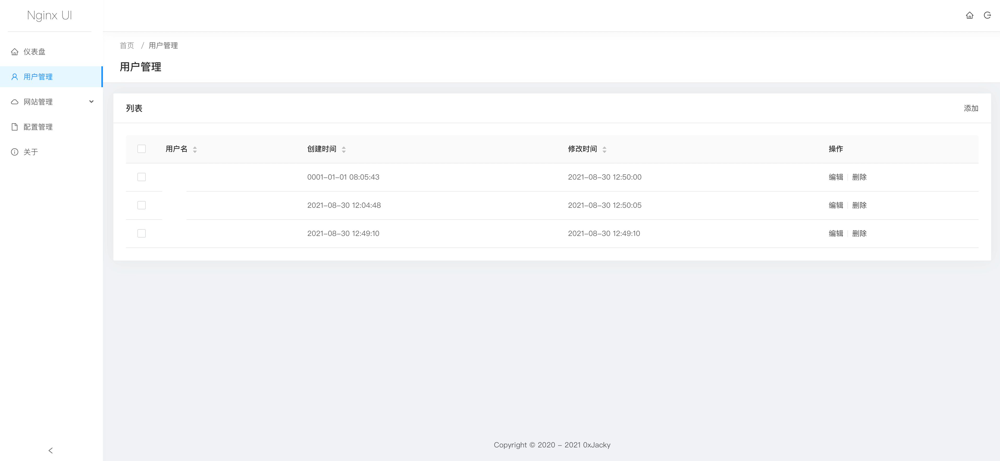
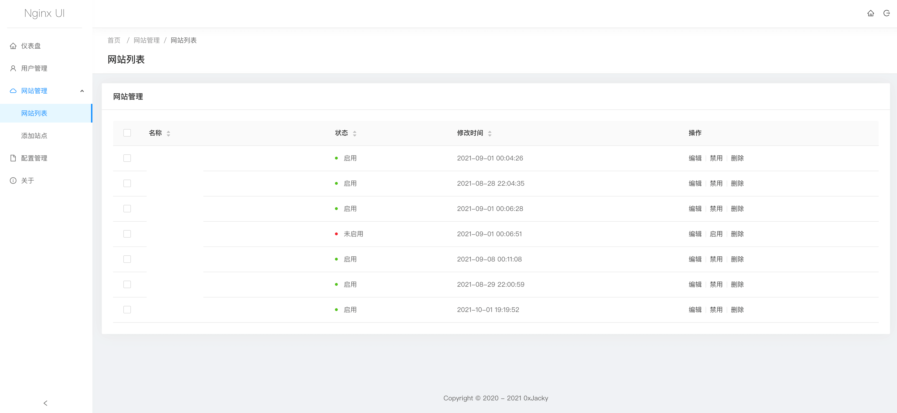
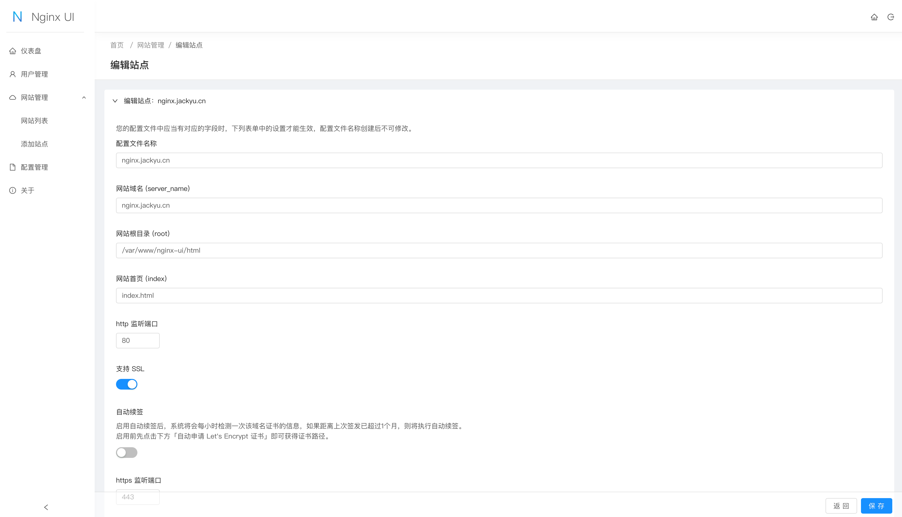
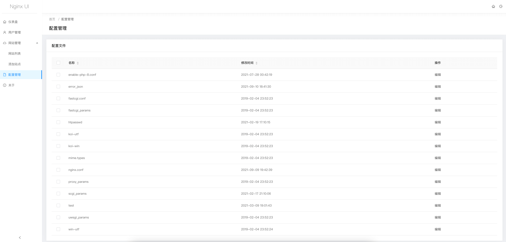
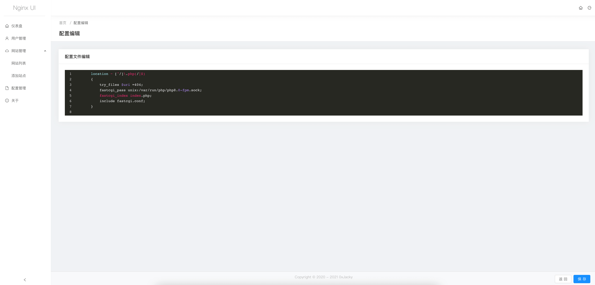

# Nginx UI

Yet another Nginx Web UI

Version: 1.2.0

*Note: Currently only available in Simplified Chinese.*

[简体中文说明](README-zh_CN.md)

## Features

1. Online view of server CPU, Memory, Load Average, Disk Usage and other indicators.
2. One-click deployment Let's Encrypt certificates.
3. Automatic renewal Let's Encrypt certificates.
4. Online editing websites configuration files.

## Install
```shell
curl -OL https://raw.githubusercontent.com/0xJacky/nginx-ui/master/install.sh && chmod +x install.sh && ./install.sh
```

## Screenshots

### Login



### Dashboard


### Users Management



### Domains Management



### Domain Editor



### Configurations Management



### Configuration Editor



## Note Before Use

The Nginx UI follows the Nginx standard of creating site configuration files in the `sites-available` directory under
the Nginx configuration directory (auto-detected). The configuration files for an enabled site will create a soft link
to the `sites-enabled` directory. Therefore, you may need to adjust the way the configuration files are organised.

## Install

1. Clone

```
git clone https://github.com/0xJacky/nginx-ui
```

2. Compiling the backend

```
cd server
go build -o nginx-ui-server main.go
```

3. Start up the backend
    1. `./nginx-ui-server` for direct run.
    2. `nohup ./nginx-ui-server &` for run as service.

4. Adding a configuration file to nginx

```
server {
    listen	80;
    listen	[::]:80;

    server_name	<your_server_name>;
    rewrite ^(.*)$  https://$host$1 permanent;
}

server {
    listen	443 ssl http2;
    listen	[::]:443 ssl http2;

    server_name	<your_server_name>;

    ssl_certificate	/path/to/ssl_cert;
    ssl_certificate_key	/path/to/ssl_cert_key;

    location / {
        proxy_set_header Host $host;
        proxy_set_header   X-Real-IP            $remote_addr;
        proxy_set_header   X-Forwarded-For      $proxy_add_x_forwarded_for;
        proxy_set_header   X-Forwarded-Proto    $scheme;
        proxy_http_version 1.1;
        proxy_set_header Upgrade $http_upgrade;
        proxy_set_header Connection upgrade;
        proxy_pass http://127.0.0.1:9000/;
    }
}
```

4. Installation

Visit `https://<your_server_name>/install` in your browser.

Enter your username and password to create initial account.

