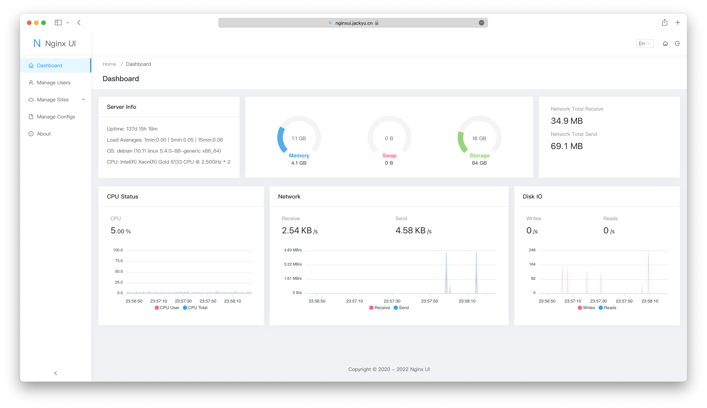

<div align="center">
      
</div>

# Nginx UI

Yet another Nginx Web UI, developed by [0xJacky](https://jackyu.cn/) and [Hintay](https://blog.kugeek.com/).

[](https://github.com/0xJacky/nginx-ui/actions/workflows/build.yml)
[](https://github.com/0xJacky/nginx-ui "Click to view the repo on Github")
[](https://github.com/0xJacky/nginx-ui/releases/latest "Click to view the repo on Github")
[](https://github.com/0xJacky/nginx-ui "Click to view the repo on Github")
[](https://github.com/0xJacky/nginx-ui "Click to view the repo on Github")
[](https://github.com/0xJacky/nginx-ui "Click to view the repo on Github")
[](https://github.com/0xJacky/nginx-ui/issue "Click to view the repo on Github")

[](https://hub.docker.com/r/uozi/nginx-ui "Click to view the image on Docker Hub")
[](https://hub.docker.com/r/uozi/nginx-ui "Click to view the image on Docker Hub")
[](https://hub.docker.com/r/uozi/nginx-ui "Click to view the image on Docker Hub")

[](https://weblate.nginxui.com/engage/nginx-ui/)
[](https://hellogithub.com/repository/86f3a8f779934748a34fe6f1b5cd442f)

## Documentation
To check out docs, visit [nginxui.com](https://nginxui.com).

## Stargazers over time

[](https://starchart.cc/0xJacky/nginx-ui)

English | [Español](README-es.md) | [简体中文](README-zh_CN.md) | [繁體中文](README-zh_TW.md) | [Tiếng Việt](README-vi_VN.md)

<details>
  <summary>Table of Contents</summary>
  <ol>
    <li>
      <a href="#about-the-project">About The Project</a>
      <ul>
        <li><a href="#demo">Demo</a></li>
        <li><a href="#features">Features</a></li>
        <li><a href="#internationalization">Internationalization</a></li>
        <li><a href="#built-with">Built With</a></li>
      </ul>
    </li>
    <li>
      <a href="#getting-started">Getting Started</a>
      <ul>
        <li><a href="#before-use">Before Use</a></li>
        <li><a href="#installation">Installation</a></li>
        <li>
          <a href="#usage">Usage</a>
          <ul>
            <li><a href="#from-executable">From Executable</a></li>
            <li><a href="#with-systemd">With Systemd</a></li>
            <li><a href="#with-docker">With Docker</a></li>
          </ul>
        </li>
      </ul>
    </li>
    <li>
      <a href="#manual-build">Manual Build</a>
      <ul>
        <li><a href="#prerequisites">Prerequisites</a></li>
        <li><a href="#build-app">Build Frontend</a></li>
        <li><a href="#build-backend">Build Backend</a></li>
      </ul>
    </li>
    <li>
      <a href="#script-for-linux">Script for Linux</a>
      <ul>
        <li><a href="#basic-usage">Basic Usage</a></li>
        <li><a href="#more-usage">More Usage</a></li>
      </ul>
    </li>
    <li><a href="#example-of-nginx-reverse-proxy-configuration">Example of Nginx Reverse Proxy Configuration</a></li>
    <li><a href="#contributing">Contributing</a></li>
    <li><a href="#license">License</a></li>
  </ol>
</details>

## About The Project



### Demo
URL：[https://demo.nginxui.com](https://demo.nginxui.com)
- Username：admin
- Password：admin

### Features

- Online statistics for server indicators such as CPU usage, memory usage, load average, and disk usage.
- Automatic configuration backup after changes, with version comparison and restore capabilities
- Cluster management supporting mirroring operations to multiple nodes, making multi-server environments easy to manage
- Export encrypted Nginx / Nginx UI configurations for quick deployment and recovery to new environments
- Enhanced online ChatGPT assistant supporting multiple models, including Deepseek-R1's chain-of-thought display to help you better understand and optimize configurations
- One-click deployment and automatic renewal Let's Encrypt certificates.
- Online editing websites configurations with our self-designed **NgxConfigEditor** which is a user-friendly block editor for nginx configurations or **Ace Code Editor** which supports highlighting nginx configuration syntax.
- Online view Nginx logs
- Written in Go and Vue, distribution is a single executable binary.
- Automatically test configuration file and reload nginx after saving configuration.
- Web Terminal
- Dark Mode
- Responsive Web Design

### Internationalization

We proudly offer official support for:

- English
- Simplified Chinese
- Traditional Chinese

As non-native English speakers, we strive for accuracy, but we know there's always room for improvement. If you spot any issues, we'd love your feedback!

Thanks to our amazing community, additional languages are also available! Explore and contribute to translations on [Weblate](https://weblate.nginxui.com).

### Built With

- [The Go Programming Language](https://go.dev)
- [Gin Web Framework](https://gin-gonic.com)
- [GORM](http://gorm.io)
- [Vue 3](https://v3.vuejs.org)
- [Vite](https://vitejs.dev)
- [TypeScript](https://www.typescriptlang.org/)
- [Ant Design Vue](https://antdv.com)
- [vue3-gettext](https://github.com/jshmrtn/vue3-gettext)
- [vue3-ace-editor](https://github.com/CarterLi/vue3-ace-editor)
- [Gonginx](https://github.com/tufanbarisyildirim/gonginx)
- [lego](https://github.com/go-acme/lego)

## Getting Started

### Before Use

The Nginx UI follows the Debian web server configuration file standard. Created site configuration files will be placed in the `sites-available` folder that under the Nginx configuration folder (auto-detected). The configuration files for an enabled site will create a soft link to the `sites-enabled` folder. You may need to adjust the way the configuration files are organised.

For non-Debian (and Ubuntu) systems, you may need to change the contents of the `nginx.conf` configuration file to the Debian style as shown below.

```nginx
http {
	# ...
	include /etc/nginx/conf.d/*.conf;
	include /etc/nginx/sites-enabled/*;
}
```

For more information: [debian/conf/nginx.conf](https://salsa.debian.org/nginx-team/nginx/-/blob/master/debian/conf/nginx.conf#L59-L60)

### Installation

Nginx UI is available on the following platforms:

- macOS 11 Big Sur and later (amd64 / arm64)
- Linux 2.6.23 and later (x86 / amd64 / arm64 / armv5 / armv6 / armv7 / mips32 / mips64 / riscv64 / loongarch64)
  - Including but not limited to Debian 7 / 8, Ubuntu 12.04 / 14.04 and later, CentOS 6 / 7, Arch Linux
- FreeBSD
- OpenBSD
- Dragonfly BSD
- Openwrt

You can visit [latest release](https://github.com/0xJacky/nginx-ui/releases/latest) to download the latest distribution, or just use [installation scripts for Linux](#script-for-linux).

### Usage

In the first runtime of Nginx UI, please visit `http://<your_server_ip>:<listen_port>`
in your browser to complete the follow-up configurations.

#### From Executable
**Run Nginx UI in Terminal**

```shell
nginx-ui -config app.ini
```
Press `Control+C` in the terminal to exit Nginx UI.

**Run Nginx UI in Background**

```shell
nohup ./nginx-ui -config app.ini &
```
Stop Nginx UI with the follow command.

```shell
kill -9 $(ps -aux | grep nginx-ui | grep -v grep | awk '{print $2}')
```

#### With Systemd
If you are using the [installation script for Linux](#script-for-linux), the Nginx UI will be installed as `nginx-ui` service in systemd. Please use the `systemctl` command to control it.

**Start Nginx UI**

```shell
systemctl start nginx-ui
```
**Stop Nginx UI**

```shell
systemctl stop nginx-ui
```
**Restart Nginx UI**

```shell
systemctl restart nginx-ui
```

#### With Docker
Our docker image [uozi/nginx-ui:latest](https://hub.docker.com/r/uozi/nginx-ui) is based on the latest nginx image and
can be used to replace the Nginx on the host. By publishing the container's port 80 and 443 to the host,
you can easily make the switch.

##### Note
1. When using this container for the first time, ensure that the volume mapped to /etc/nginx is empty.
2. If you want to host static files, you can map directories to container.

<details>
<summary><b>Deploy with Docker</b></summary>

1. [Install Docker.](https://docs.docker.com/install/)

2. Then deploy nginx-ui like this:

```bash
docker run -dit \
  --name=nginx-ui \
  --restart=always \
  -e TZ=Asia/Shanghai \
  -v /mnt/user/appdata/nginx:/etc/nginx \
  -v /mnt/user/appdata/nginx-ui:/etc/nginx-ui \
  -p 8080:80 -p 8443:443 \
  uozi/nginx-ui:latest
```

3. When your docker container is running, Log in to nginx-ui panel with `http://<your_server_ip>:8080/install`.
</details>

<details>
<summary><b>Deploy with Docker-Compose</b></summary>

1. [Install Docker-Compose.](https://docs.docker.com/compose/install/)

2. Create a docker-compose.yml file like this:

```yml
services:
    nginx-ui:
        stdin_open: true
        tty: true
        container_name: nginx-ui
        restart: always
        environment:
            - TZ=Asia/Shanghai
        volumes:
            - '/mnt/user/appdata/nginx:/etc/nginx'
            - '/mnt/user/appdata/nginx-ui:/etc/nginx-ui'
            - '/var/www:/var/www'
        ports:
            - 8080:80
            - 8443:443
        image: 'uozi/nginx-ui:latest'
```

3. Then creat your container by:
```bash
docker compose up -d
```

4. When your docker container is running, Log in to nginx-ui panel with `http://<your_server_ip>:8080/install`.

</details>

## Manual Build

On platforms that do not have an official build version, they can be built manually.

### Prerequisites

- Make

- Golang 1.23+

- node.js 21+

  ```shell
  npx browserslist@latest --update-db
  ```

### Build Frontend

Please execute the following command in `app` directory.

```shell
pnpm install
pnpm build
```

### Build Backend

Please build the app first, and then execute the following command in the project root directory.

```shell
go generate
go build -tags=jsoniter -ldflags "$LD_FLAGS -X 'github.com/0xJacky/Nginx-UI/settings.buildTime=$(date +%s)'" -o nginx-ui -v main.go
```

## Script for Linux

### Basic Usage

**Install and Upgrade**

```shell
bash -c "$(curl -L https://raw.githubusercontent.com/0xJacky/nginx-ui/main/install.sh)" @ install
```
The default listening port is `9000`, and the default HTTP Challenge port is `9180`.
If there is a port conflict, please modify `/usr/local/etc/nginx-ui/app.ini` manually,
then use `systemctl restart nginx-ui` to reload the Nginx UI service.

**Remove Nginx UI, except configuration and database files**

```shell
bash -c "$(curl -L https://raw.githubusercontent.com/0xJacky/nginx-ui/main/install.sh)" @ remove
```

### More Usage

````shell
bash -c "$(curl -L https://raw.githubusercontent.com/0xJacky/nginx-ui/main/install.sh)" @ help
````

## Example of Nginx Reverse Proxy Configuration

```nginx
server {
    listen          80;
    listen          [::]:80;

    server_name     <your_server_name>;
    rewrite ^(.*)$  https://$host$1 permanent;
}

map $http_upgrade $connection_upgrade {
    default upgrade;
    ''      close;
}

server {
    listen  443       ssl;
    listen  [::]:443  ssl;
    http2   on;

    server_name         <your_server_name>;

    ssl_certificate     /path/to/ssl_cert;
    ssl_certificate_key /path/to/ssl_cert_key;

    location / {
        proxy_set_header    Host                $host;
        proxy_set_header    X-Real-IP           $remote_addr;
        proxy_set_header    X-Forwarded-For     $proxy_add_x_forwarded_for;
        proxy_set_header    X-Forwarded-Proto   $scheme;
        proxy_http_version  1.1;
        proxy_set_header    Upgrade             $http_upgrade;
        proxy_set_header    Connection          $connection_upgrade;
        proxy_pass          http://127.0.0.1:9000/;
    }
}
```

## Contributing

Contributions are what make the open source community such an amazing place to learn, inspire, and create. Any contributions you  make are **greatly appreciated**.

If you have a suggestion that would make this better, please fork the repo and create a pull request. You can also simply open an issue with the tag "enhancement". Don't forget to give the project a star! Thanks again!

1. Fork the Project
2. Create your Feature Branch (`git checkout -b feature/AmazingFeature`)
3. Commit your Changes (`git commit -m 'Add some AmazingFeature'`)
4. Push to the Branch (`git push origin feature/AmazingFeature`)
5. Open a Pull Request

## License

This project is provided under a GNU Affero General Public License v3.0 license that can be found in the [LICENSE](LICENSE) file. By using, distributing, or contributing to this project, you agree to the terms and conditions of this license.
