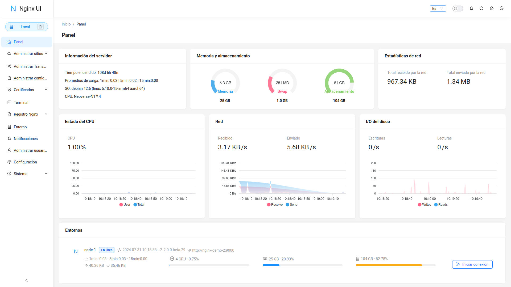

<div align="center">
      
</div>

# Nginx UI
Otra interfaz web para Nginx, desarrollada por [0xJacky](https://jackyu.cn/), [Hintay](https://blog.kugeek.com/) y [Akino](https://github.com/akinoccc).

[![DeepWiki](https://img.shields.io/badge/DeepWiki-0xJacky%2Fnginx--ui-blue.svg?logo=data:image/png;base64,iVBORw0KGgoAAAANSUhEUgAAACwAAAAyCAYAAAAnWDnqAAAAAXNSR0IArs4c6QAAA05JREFUaEPtmUtyEzEQhtWTQyQLHNak2AB7ZnyXZMEjXMGeK/AIi+QuHrMnbChYY7MIh8g01fJoopFb0uhhEqqcbWTp06/uv1saEDv4O3n3dV60RfP947Mm9/SQc0ICFQgzfc4CYZoTPAswgSJCCUJUnAAoRHOAUOcATwbmVLWdGoH//PB8mnKqScAhsD0kYP3j/Yt5LPQe2KvcXmGvRHcDnpxfL2zOYJ1mFwrryWTz0advv1Ut4CJgf5uhDuDj5eUcAUoahrdY/56ebRWeraTjMt/00Sh3UDtjgHtQNHwcRGOC98BJEAEymycmYcWwOprTgcB6VZ5JK5TAJ+fXGLBm3FDAmn6oPPjR4rKCAoJCal2eAiQp2x0vxTPB3ALO2CRkwmDy5WohzBDwSEFKRwPbknEggCPB/imwrycgxX2NzoMCHhPkDwqYMr9tRcP5qNrMZHkVnOjRMWwLCcr8ohBVb1OMjxLwGCvjTikrsBOiA6fNyCrm8V1rP93iVPpwaE+gO0SsWmPiXB+jikdf6SizrT5qKasx5j8ABbHpFTx+vFXp9EnYQmLx02h1QTTrl6eDqxLnGjporxl3NL3agEvXdT0WmEost648sQOYAeJS9Q7bfUVoMGnjo4AZdUMQku50McDcMWcBPvr0SzbTAFDfvJqwLzgxwATnCgnp4wDl6Aa+Ax283gghmj+vj7feE2KBBRMW3FzOpLOADl0Isb5587h/U4gGvkt5v60Z1VLG8BhYjbzRwyQZemwAd6cCR5/XFWLYZRIMpX39AR0tjaGGiGzLVyhse5C9RKC6ai42ppWPKiBagOvaYk8lO7DajerabOZP46Lby5wKjw1HCRx7p9sVMOWGzb/vA1hwiWc6jm3MvQDTogQkiqIhJV0nBQBTU+3okKCFDy9WwferkHjtxib7t3xIUQtHxnIwtx4mpg26/HfwVNVDb4oI9RHmx5WGelRVlrtiw43zboCLaxv46AZeB3IlTkwouebTr1y2NjSpHz68WNFjHvupy3q8TFn3Hos2IAk4Ju5dCo8B3wP7VPr/FGaKiG+T+v+TQqIrOqMTL1VdWV1DdmcbO8KXBz6esmYWYKPwDL5b5FA1a0hwapHiom0r/cKaoqr+27/XcrS5UwSMbQAAAABJRU5ErkJggg==)](https://deepwiki.com/0xJacky/nginx-ui)
[](https://deepwiki.com/0xJacky/nginx-ui)

[](https://nginxui.com)

<p>
  <a href="https://atomgit.com/uozi/nginx-ui" target="_blank" title="Este proyecto forma parte del programa AtomGit G-Star">
    
  </a>
  &nbsp;Alojado con orgullo en <a href="https://atomgit.com/uozi/nginx-ui">AtomGit</a> — parte del programa <b>G-Star</b>.
</p>

[](https://atomgit.com/uozi/nginx-ui)

[](https://github.com/0xJacky/nginx-ui/actions/workflows/build.yml)
[](https://github.com/0xJacky/nginx-ui "Click to view the repo on Github")
[](https://github.com/0xJacky/nginx-ui/releases/latest "Click to view the repo on Github")
[](https://github.com/0xJacky/nginx-ui "Click to view the repo on Github")
[](https://github.com/0xJacky/nginx-ui "Click to view the repo on Github")
[](https://github.com/0xJacky/nginx-ui "Click to view the repo on Github")
[](https://github.com/0xJacky/nginx-ui/issues "Click to view the repo on Github")

[](https://hub.docker.com/r/uozi/nginx-ui "Click to view the image on Docker Hub")
[](https://hub.docker.com/r/uozi/nginx-ui "Click to view the image on Docker Hub")
[](https://hub.docker.com/r/uozi/nginx-ui "Click to view the image on Docker Hub")

[](https://hellogithub.com/repository/86f3a8f779934748a34fe6f1b5cd442f)

## Documentación
Para consultar la documentación, visite [nginxui.com](https://nginxui.com).

## Patrocinio

Si este proyecto le resulta útil, considere patrocinarnos para apoyar el desarrollo y el mantenimiento continuos.

[](https://github.com/sponsors/nginxui)
[](https://afdian.com/a/nginxui)

### Patrocinadores

<a href="https://www.axisnow.io/" target="_blank">
  
</a>

Proteja y acelere sitios web y API con un rendimiento de acceso consistente en China continental y en todo el mundo, y extienda la aceleración y la seguridad a aplicaciones nativas y móviles mediante SDK de cliente — **CDN privada autoalojada｜CDN anti-DDoS por suscripción｜Una red CDN autogestionada y flexible.**

### Grupo oficial de la comunidad

Únase al grupo oficial de la comunidad de Nginx UI en WeChat para hablar con otros usuarios sobre uso, despliegue y resolución de problemas.

Escanee el siguiente código QR para agregarnos en WeChat e incluya `Nginx UI Community Group` en su solicitud. Un administrador le invitará al grupo oficial de la comunidad.

<p align="center">
  
</p>

Su apoyo nos ayuda a:
- 🚀 Acelerar el desarrollo de nuevas funciones
- 🐛 Corregir errores y mejorar la estabilidad
- 📚 Mejorar la documentación y los tutoriales
- 🌐 Ofrecer un mejor soporte comunitario
- 💻 Mantener la infraestructura y los servidores de demostración

### Soporte de herramientas

<a href="https://www.jetbrains.com/?from=nginx-ui" target="_blank">
  
</a>

Gracias a [JetBrains](https://www.jetbrains.com/?from=nginx-ui) por apoyarnos con licencias open source gratuitas.


## Stargazers en el tiempo

[](https://cloud.nginxui.com/stars/0xJacky/nginx-ui.svg)

[English](../../README.md) | Español | [简体中文](README-zh_CN.md) | [繁體中文](README-zh_TW.md) | [Tiếng Việt](README-vi_VN.md) | [日本語](README-ja_JP.md)

<details>
  <summary>Tabla de contenidos</summary>
  <ol>
    <li>
      <a href="#sobre-el-proyecto">Sobre el proyecto</a>
      <ul>
        <li><a href="#demostración">Demostración</a></li>
        <li><a href="#características">Características</a></li>
        <li><a href="#internacionalización">Internacionalización</a></li>
      </ul>
    </li>
    <li>
      <a href="#cómo-empezar">Cómo empezar</a>
      <ul>
        <li><a href="#antes-de-usar">Antes de usar</a></li>
        <li><a href="#instalación">Instalación</a></li>
        <li>
          <a href="#uso">Uso</a>
          <ul>
            <li><a href="#desde-el-ejecutable">Desde el ejecutable</a></li>
            <li><a href="#con-systemd">Con Systemd</a></li>
            <li><a href="#con-docker">Con Docker</a></li>
          </ul>
        </li>
      </ul>
    </li>
    <li>
      <a href="#compilación-manual">Compilación manual</a>
      <ul>
        <li><a href="#prerrequisitos">Prerrequisitos</a></li>
        <li><a href="#compilación-del-frontend">Compilación del Frontend</a></li>
        <li><a href="#compilación-del-backend">Compilación del Backend</a></li>
      </ul>
    </li>
    <li>
      <a href="#script-para-linux">Script para Linux</a>
      <ul>
        <li><a href="#uso-básico">Uso básico</a></li>
        <li><a href="#uso-avanzado">Uso avanzado</a></li>
      </ul>
    </li>
    <li><a href="#ejemplo-de-configuración-de-proxy-reverso-de-nginx">Ejemplo de configuración de proxy reverso de Nginx</a></li>
    <li><a href="#contribuir">Contribuir</a></li>
    <li><a href="#licencia">Licencia</a></li>
  </ol>
</details>

## Sobre el proyecto



### Demostración
URL: [https://demo.nginxui.com](https://demo.nginxui.com)
- Nombre de usuario: admin
- Contraseña: admin

### Características

- Estadísticas en línea de indicadores del servidor como uso de CPU, memoria, promedio de carga y uso de disco
- Copia de seguridad automática tras cambios de configuración, con comparación de versiones y restauración
- Gestión de clústeres con operaciones de espejo hacia múltiples nodos, para administrar fácilmente entornos multi-servidor
- Exportación cifrada de configuraciones de Nginx / Nginx UI para un despliegue y recuperación rápidos en nuevos entornos
- Asistente **ChatGPT** en línea mejorado, compatible con múltiples modelos, incluida la visualización de la cadena de pensamiento de Deepseek-R1 para comprender y optimizar mejor las configuraciones
- **MCP** (Model Context Protocol) ofrece interfaces especiales para que agentes de IA interactúen con Nginx UI, permitiendo la gestión automatizada de configuraciones y el control de servicios
- Despliegue con un clic y renovación automática de certificados Let's Encrypt
- Edición en línea de configuraciones de sitios con nuestro editor de bloques **NgxConfigEditor**, o con **Ace Code Editor**, que admite **completado de código por LLM** y resaltado de sintaxis de nginx
- Visualización en línea de los registros de Nginx
- Escrito en Go y Vue; la distribución es un único binario ejecutable
- Prueba automática del archivo de configuración y recarga de nginx tras guardar
- Terminal web
- Modo oscuro
- Diseño web adaptable

### Internacionalización

Ofrecemos soporte oficial para:

- Inglés
- Chino simplificado
- Chino tradicional

Como hablantes no nativos de inglés, nos esforzamos por la precisión, pero siempre hay margen de mejora. Si detecta algún problema, ¡agradezcamos sus comentarios!

Gracias a la comunidad, también hay más idiomas disponibles. Explore y contribuya a las traducciones en [Weblate](https://weblate.nginxui.com).


## Cómo empezar

### Antes de usar

Nginx UI sigue el estándar de archivos de configuración de servidores web de Debian. Los archivos de configuración de sitios creados se colocan en la carpeta `sites-available` dentro del directorio de configuración de Nginx (detectado automáticamente). Los sitios habilitados crean un enlace simbólico en `sites-enabled`. Es posible que deba ajustar la organización de sus archivos de configuración.

En sistemas que no sean Debian (ni Ubuntu), es posible que deba cambiar el contenido de `nginx.conf` al estilo Debian, como se muestra a continuación.

```nginx
http {
	# ...
	include /etc/nginx/conf.d/*.conf;
	include /etc/nginx/sites-enabled/*;
}
```

Más información: [debian/conf/nginx.conf](https://salsa.debian.org/nginx-team/nginx/-/blob/debian/latest/debian/conf/nginx.conf#L60-L61)

### Instalación

Nginx UI está disponible en las siguientes plataformas:

- macOS 11 Big Sur y posteriores (amd64 / arm64)
- Windows 10 y posteriores (amd64 / arm64)
- Linux 2.6.23 y posteriores (x86 / amd64 / arm64 / armv5 / armv6 / armv7 / mips32 / mips64 / riscv64 / loongarch64)
  - Incluyendo, entre otros, Debian 7 / 8, Ubuntu 12.04 / 14.04 y posteriores, CentOS 6 / 7, Arch Linux
- FreeBSD
- OpenBSD
- Dragonfly BSD
- Openwrt

Puede visitar [la última versión](https://github.com/0xJacky/nginx-ui/releases/latest) para descargar la distribución más reciente, o usar el [script de instalación para Linux](#script-para-linux).

### Uso

En la primera ejecución de Nginx UI, visite `http://<your_server_ip>:<listen_port>` en su navegador para completar la configuración inicial.

#### Desde el ejecutable
**Ejecutar Nginx UI en la terminal**

```shell
nginx-ui -config app.ini
```
Pulse `Control+C` en la terminal para salir de Nginx UI.

**Ejecutar Nginx UI en segundo plano**

```shell
nohup ./nginx-ui -config app.ini &
```
Detenga Nginx UI con el siguiente comando:

```shell
kill -9 $(ps -aux | grep nginx-ui | grep -v grep | awk '{print $2}')
```

#### Con Systemd
Si utiliza el [script de instalación para Linux](#script-para-linux), Nginx UI se instalará como el servicio `nginx-ui` en systemd. Use el comando `systemctl` para controlarlo.

**Iniciar Nginx UI**

```shell
systemctl start nginx-ui
```
**Detener Nginx UI**

```shell
systemctl stop nginx-ui
```
**Reiniciar Nginx UI**

```shell
systemctl restart nginx-ui
```

#### Con Docker
Nuestra imagen de Docker [uozi/nginx-ui:latest](https://hub.docker.com/r/uozi/nginx-ui) se basa en la última imagen de nginx y puede usarse para reemplazar Nginx en el host. Al publicar los puertos 80 y 443 del contenedor en el host, puede realizar el cambio fácilmente.

##### Nota
1. Al usar este contenedor por primera vez, asegúrese de que el volumen mapeado a `/etc/nginx` esté vacío.
2. Si desea alojar archivos estáticos, puede mapear directorios al contenedor.
3. Si actualiza desde una imagen antigua, consulte la [guía de corrección de WebSocket en Docker](https://nginxui.com/guide/docker-websocket-fix.html) para actualizar `conf.d/nginx-ui.conf`.

<details>
<summary><b>Desplegar con Docker</b></summary>

1. [Instale Docker.](https://docs.docker.com/install/)

2. Luego despliegue nginx-ui así:

```bash
docker run -dit \
  --name=nginx-ui \
  --restart=always \
  -e TZ=Asia/Shanghai \
  -v /mnt/user/appdata/nginx:/etc/nginx \
  -v /mnt/user/appdata/nginx-ui:/etc/nginx-ui \
  -v /var/run/docker.sock:/var/run/docker.sock \
  -p 8080:80 -p 8443:443 \
  uozi/nginx-ui:latest
```

3. Cuando el contenedor esté en ejecución, acceda al panel en `http://<your_server_ip>:8080/install`.
   Si cambia el mapeo de puertos, acceda a Nginx UI a través del puerto del host mapeado al puerto `80` del contenedor.
</details>

<details>
<summary><b>Desplegar con Docker Compose</b></summary>

1. [Instale Docker Compose.](https://docs.docker.com/compose/install/)

2. Cree un archivo `docker-compose.yml` como este:

```yml
services:
    nginx-ui:
        stdin_open: true
        tty: true
        container_name: nginx-ui
        restart: always
        environment:
            - TZ=Asia/Shanghai
        volumes:
            - '/mnt/user/appdata/nginx:/etc/nginx'
            - '/mnt/user/appdata/nginx-ui:/etc/nginx-ui'
            - '/var/www:/var/www'
            - '/var/run/docker.sock:/var/run/docker.sock'
        ports:
            - 8080:80
            - 8443:443
        image: 'uozi/nginx-ui:latest'
```

3. Luego cree el contenedor con:
```bash
docker compose up -d
```

4. Cuando el contenedor esté en ejecución, acceda al panel en `http://<your_server_ip>:8080/install`.
   Si cambia el mapeo de puertos, acceda a Nginx UI a través del puerto del host mapeado al puerto `80` del contenedor.

</details>

## Compilación manual

En plataformas sin una versión de compilación oficial, puede compilarse manualmente.

### Prerrequisitos

- Make

- Golang 1.23+

- node.js 21+

  ```shell
  npx browserslist@latest --update-db
  ```

### Compilación del Frontend

Ejecute el siguiente comando en el directorio `app`.

```shell
bun install
bun run build
```

### Compilación del Backend

Primero compile el frontend y luego ejecute el siguiente comando en el directorio raíz del proyecto.

```shell
go generate
go build -tags=jsoniter -ldflags "$LD_FLAGS -X 'github.com/0xJacky/Nginx-UI/settings.buildTime=$(date +%s)'" -o nginx-ui -v main.go
```

## Script para Linux

### Uso básico

**Instalar y actualizar**

```shell
bash -c "$(curl -L https://cloud.nginxui.com/install.sh)" @ install
```
El puerto de escucha predeterminado es `9000` y el puerto de desafío HTTP predeterminado es `9180`.
Si hay un conflicto de puertos, modifique manualmente `/usr/local/etc/nginx-ui/app.ini`
y luego use `systemctl restart nginx-ui` para recargar el servicio de Nginx UI.

**Eliminar Nginx UI, excepto los archivos de configuración y la base de datos**

```shell
bash -c "$(curl -L https://cloud.nginxui.com/install.sh)" @ remove
```

### Uso avanzado

````shell
bash -c "$(curl -L https://cloud.nginxui.com/install.sh)" @ help
````

## Ejemplo de configuración de proxy reverso de Nginx

```nginx
server {
    listen          80;
    listen          [::]:80;

    server_name     <your_server_name>;
    rewrite ^(.*)$  https://$host$1 permanent;
}

map $http_upgrade $connection_upgrade {
    default upgrade;
    ''      close;
}

server {
    listen  443       ssl;
    listen  [::]:443  ssl;
    http2   on;

    server_name         <your_server_name>;

    ssl_certificate     /path/to/ssl_cert;
    ssl_certificate_key /path/to/ssl_cert_key;

    location / {
        proxy_set_header    Host                $host;
        proxy_set_header    X-Real-IP           $remote_addr;
        proxy_set_header    X-Forwarded-For     $proxy_add_x_forwarded_for;
        proxy_set_header    X-Forwarded-Proto   $scheme;
        proxy_http_version  1.1;
        proxy_set_header    Upgrade             $http_upgrade;
        proxy_set_header    Connection          $connection_upgrade;
        proxy_pass          http://127.0.0.1:9000/;
    }
}
```

## Contribuir

Las contribuciones hacen que la comunidad de código abierto sea un lugar increíble para aprender, inspirar y crear. Cualquier contribución que haga es **muy apreciada**.

Si tiene una sugerencia para mejorar este proyecto, bifurque el repositorio y cree un pull request. También puede abrir un issue con la etiqueta «enhancement». ¡No olvide darle una estrella al proyecto! ¡Gracias de nuevo!

1. Bifurcar el proyecto
2. Crear su rama de función (`git checkout -b feature/AmazingFeature`)
3. Confirmar los cambios (`git commit -m 'Add some AmazingFeature'`)
4. Enviar la rama (`git push origin feature/AmazingFeature`)
5. Abrir un Pull Request

## Licencia

Este proyecto se proporciona bajo la licencia GNU Affero General Public License v3.0, que puede encontrarse en el archivo [LICENSE](../../LICENSE). Al usar, distribuir o contribuir a este proyecto, acepta los términos y condiciones de esta licencia.
