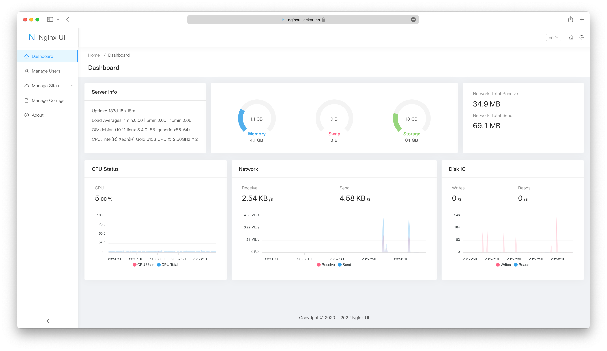

<div align="center">
      
</div>

# Nginx UI
もう一つの Nginx Web UI。開発：[0xJacky](https://jackyu.cn/)、[Hintay](https://blog.kugeek.com/)、[Akino](https://github.com/akinoccc)。

[![DeepWiki](https://img.shields.io/badge/DeepWiki-0xJacky%2Fnginx--ui-blue.svg?logo=data:image/png;base64,iVBORw0KGgoAAAANSUhEUgAAACwAAAAyCAYAAAAnWDnqAAAAAXNSR0IArs4c6QAAA05JREFUaEPtmUtyEzEQhtWTQyQLHNak2AB7ZnyXZMEjXMGeK/AIi+QuHrMnbChYY7MIh8g01fJoopFb0uhhEqqcbWTp06/uv1saEDv4O3n3dV60RfP947Mm9/SQc0ICFQgzfc4CYZoTPAswgSJCCUJUnAAoRHOAUOcATwbmVLWdGoH//PB8mnKqScAhsD0kYP3j/Yt5LPQe2KvcXmGvRHcDnpxfL2zOYJ1mFwrryWTz0advv1Ut4CJgf5uhDuDj5eUcAUoahrdY/56ebRWeraTjMt/00Sh3UDtjgHtQNHwcRGOC98BJEAEymycmYcWwOprTgcB6VZ5JK5TAJ+fXGLBm3FDAmn6oPPjR4rKCAoJCal2eAiQp2x0vxTPB3ALO2CRkwmDy5WohzBDwSEFKRwPbknEggCPB/imwrycgxX2NzoMCHhPkDwqYMr9tRcP5qNrMZHkVnOjRMWwLCcr8ohBVb1OMjxLwGCvjTikrsBOiA6fNyCrm8V1rP93iVPpwaE+gO0SsWmPiXB+jikdf6SizrT5qKasx5j8ABbHpFTx+vFXp9EnYQmLx02h1QTTrl6eDqxLnGjporxl3NL3agEvXdT0WmEost648sQOYAeJS9Q7bfUVoMGnjo4AZdUMQku50McDcMWcBPvr0SzbTAFDfvJqwLzgxwATnCgnp4wDl6Aa+Ax283gghmj+vj7feE2KBBRMW3FzOpLOADl0Isb5587h/U4gGvkt5v60Z1VLG8BhYjbzRwyQZemwAd6cCR5/XFWLYZRIMpX39AR0tjaGGiGzLVyhse5C9RKC6ai42ppWPKiBagOvaYk8lO7DajerabOZP46Lby5wKjw1HCRx7p9sVMOWGzb/vA1hwiWc6jm3MvQDTogQkiqIhJV0nBQBTU+3okKCFDy9WwferkHjtxib7t3xIUQtHxnIwtx4mpg26/HfwVNVDb4oI9RHmx5WGelRVlrtiw43zboCLaxv46AZeB3IlTkwouebTr1y2NjSpHz68WNFjHvupy3q8TFn3Hos2IAk4Ju5dCo8B3wP7VPr/FGaKiG+T+v+TQqIrOqMTL1VdWV1DdmcbO8KXBz6esmYWYKPwDL5b5FA1a0hwapHiom0r/cKaoqr+27/XcrS5UwSMbQAAAABJRU5ErkJggg==)](https://deepwiki.com/0xJacky/nginx-ui)
[](https://deepwiki.com/0xJacky/nginx-ui)

[](https://nginxui.com)

<p>
  <a href="https://atomgit.com/uozi/nginx-ui" target="_blank" title="本プロジェクトは AtomGit G-Star プログラムの一部です">
    
  </a>
  &nbsp;<a href="https://atomgit.com/uozi/nginx-ui">AtomGit</a> にてホスト — <b>G-Star</b> プログラムの一員です。
</p>

[](https://atomgit.com/uozi/nginx-ui)

[](https://github.com/0xJacky/nginx-ui/actions/workflows/build.yml)
[](https://github.com/0xJacky/nginx-ui "Click to view the repo on Github")
[](https://github.com/0xJacky/nginx-ui/releases/latest "Click to view the repo on Github")
[](https://github.com/0xJacky/nginx-ui "Click to view the repo on Github")
[](https://github.com/0xJacky/nginx-ui "Click to view the repo on Github")
[](https://github.com/0xJacky/nginx-ui "Click to view the repo on Github")
[](https://github.com/0xJacky/nginx-ui/issues "Click to view the repo on Github")

[](https://hub.docker.com/r/uozi/nginx-ui "Click to view the image on Docker Hub")
[](https://hub.docker.com/r/uozi/nginx-ui "Click to view the image on Docker Hub")
[](https://hub.docker.com/r/uozi/nginx-ui "Click to view the image on Docker Hub")

[](https://hellogithub.com/repository/86f3a8f779934748a34fe6f1b5cd442f)

## ドキュメント
公式ドキュメントは [nginxui.com](https://nginxui.com) を参照してください。

## スポンサー

本プロジェクトが役に立った場合は、継続的な開発とメンテナンスを支援するため、スポンサーをご検討ください。

[](https://github.com/sponsors/nginxui)
[](https://afdian.com/a/nginxui)

### スポンサー企業

<a href="https://www.axisnow.io/" target="_blank">
  
</a>

中国本土および世界各地で一貫したアクセス性能を提供し、Web サイトと API を保護・加速。クライアント SDK によりネイティブ／モバイルアプリにも加速とセキュリティを拡張 — **セルフホスト型プライベート CDN｜サブスクリプション型アンチ DDoS CDN｜柔軟に組み合わせ可能な自律制御 CDN ネットワーク。**

### 公式コミュニティグループ

Nginx UI 公式 WeChat コミュニティグループへぜひご参加ください。利用方法、デプロイ構成、トラブルシューティングについて他のユーザーと交流できます。

以下の QR コードを WeChat で読み取り、申請時に `Nginx UI Community Group` と記載してください。管理者が公式コミュニティグループへ招待します。

<p align="center">
  
</p>

ご支援により、次のことが可能になります：
- 🚀 新機能開発の加速
- 🐛 バグ修正と安定性の向上
- 📚 ドキュメントとチュートリアルの充実
- 🌐 より良いコミュニティサポート
- 💻 インフラとデモサーバーの維持

### ツール支援

<a href="https://www.jetbrains.com/?from=nginx-ui" target="_blank">
  
</a>

[JetBrains](https://www.jetbrains.com/?from=nginx-ui) より無償のオープンソースライセンスをご提供いただき、感謝申し上げます。


## Stargazers over time

[](https://cloud.nginxui.com/stars/0xJacky/nginx-ui.svg)

[English](../../README.md) | [Español](README-es.md) | [简体中文](README-zh_CN.md) | [繁體中文](README-zh_TW.md) | [Tiếng Việt](README-vi_VN.md) | 日本語

<details>
  <summary>目次</summary>
  <ol>
    <li>
      <a href="#プロジェクトについて">プロジェクトについて</a>
      <ul>
        <li><a href="#デモ">デモ</a></li>
        <li><a href="#機能">機能</a></li>
        <li><a href="#多言語化">多言語化</a></li>
      </ul>
    </li>
    <li>
      <a href="#はじめに">はじめに</a>
      <ul>
        <li><a href="#使用前の注意">使用前の注意</a></li>
        <li><a href="#インストール">インストール</a></li>
        <li>
          <a href="#使い方">使い方</a>
          <ul>
            <li><a href="#実行ファイルから">実行ファイルから</a></li>
            <li><a href="#systemdで">Systemdで</a></li>
            <li><a href="#dockerで">Dockerで</a></li>
          </ul>
        </li>
      </ul>
    </li>
    <li>
      <a href="#手動ビルド">手動ビルド</a>
      <ul>
        <li><a href="#前提条件">前提条件</a></li>
        <li><a href="#フロントエンドのビルド">フロントエンドのビルド</a></li>
        <li><a href="#バックエンドのビルド">バックエンドのビルド</a></li>
      </ul>
    </li>
    <li>
      <a href="#linux用スクリプト">Linux用スクリプト</a>
      <ul>
        <li><a href="#基本的な使い方">基本的な使い方</a></li>
        <li><a href="#その他の使い方">その他の使い方</a></li>
      </ul>
    </li>
    <li><a href="#nginx-リバースプロキシ設定例">Nginx リバースプロキシ設定例</a></li>
    <li><a href="#貢献方法">貢献方法</a></li>
    <li><a href="#ライセンス">ライセンス</a></li>
  </ol>
</details>

## プロジェクトについて



### デモ
URL：[https://demo.nginxui.com](https://demo.nginxui.com)
- ユーザー名：admin
- パスワード：admin

### 機能

- CPU 使用率、メモリ使用率、ロードアベレージ、ディスク使用率などのサーバー指標をオンラインで確認可能
- 設定変更時に自動でバックアップを作成し、バージョン比較や復元に対応
- 複数ノード間での設定ミラーリングをサポートし、マルチサーバー環境を容易に管理可能
- 暗号化された Nginx / Nginx UI の設定をエクスポートし、新しい環境への迅速なデプロイや復旧が可能
- オンライン **ChatGPT** アシスタントを搭載。複数モデルに対応し、DeepSeek-R1 の Chain-of-Thought 表示で設定の理解と最適化を支援
- **MCP**（Model Context Protocol）で AI エージェントが Nginx UI と連携するための専用インターフェースを提供し、設定管理やサービス制御の自動化を実現
- Let’s Encrypt 証明書の発行および自動更新をワンクリックで実行可能
- 自社開発の **NgxConfigEditor**（ブロックエディタ）、および **LLM コード補完** と nginx 設定のシンタックスハイライトに対応した **Ace Code Editor** を搭載
- Web UI 上から Nginx ログを直接確認可能
- Go と Vue で実装され、単一の実行バイナリとして配布
- 設定保存時に設定テストを自動実行し、成功時のみ nginx を再読み込み
- Web ターミナル
- ダークモード対応
- レスポンシブデザイン

### 多言語化

下記の言語を公式でサポートしています：

- 英語
- 簡体字中国語
- 繁體字中国語

非ネイティブによる翻訳のため、不自然な表現が含まれている可能性があります。
お気づきの点がございましたら、ぜひフィードバックをお寄せください。

コミュニティのご協力により、他の言語の翻訳も多数提供されています。
翻訳にご参加いただける方は、[Weblate](https://weblate.nginxui.com) をご覧ください。


## はじめに

### 使用前の注意

Nginx UI は、Debian 系 Web サーバーの設定ファイル構成標準に準拠しています。
作成されたサイト設定ファイルは、自動的に検出された Nginx の設定ディレクトリ内の `sites-available` に配置されます。
有効化されたサイトについては、`sites-enabled` にシンボリックリンクが作成されます。構成の整理方法を事前に調整する必要がある場合があります。

Debian 系以外のディストリビューション（Ubuntu を除く）を使用している場合は、以下の例を参考に `nginx.conf` を Debian スタイルの構成に変更してください。

```nginx
http {
	# ...
	include /etc/nginx/conf.d/*.conf;
	include /etc/nginx/sites-enabled/*;
}
```

詳細：[debian/conf/nginx.conf](https://salsa.debian.org/nginx-team/nginx/-/blob/debian/latest/debian/conf/nginx.conf#L60-L61)

### インストール

Nginx UI は以下のプラットフォームで利用可能です：

- macOS 11 Big Sur 以降（amd64 / arm64）
- Windows 10 以降（amd64 / arm64）
- Linux 2.6.23 以降（x86 / amd64 / arm64 / armv5 / armv6 / armv7 / mips32 / mips64 / riscv64 / loongarch64）
  - Debian 7 / 8、Ubuntu 12.04 / 14.04 以降、CentOS 6 / 7、Arch Linux など（これらに限定されません）
- FreeBSD
- OpenBSD
- Dragonfly BSD
- Openwrt

最新リリースは [リリースページ](https://github.com/0xJacky/nginx-ui/releases/latest) からダウンロードするか、[Linux 用インストールスクリプト](#linux用スクリプト) をご利用ください。

### 使い方

初回起動後、ブラウザで `http://<your_server_ip>:<listen_port>` にアクセスし、初期設定を完了してください。

#### 実行ファイルから
**ターミナルで Nginx UI を動かす**

```shell
nginx-ui -config app.ini
```
`Control+C` で終了します。

**バックグラウンドで Nginx UI を動かす**

```shell
nohup ./nginx-ui -config app.ini &
```
以下のコマンドで Nginx UI を停止します。

```shell
kill -9 $(ps -aux | grep nginx-ui | grep -v grep | awk '{print $2}')
```

#### Systemdで
[Linux 用インストールスクリプト](#linux用スクリプト) を使うと、`nginx-ui` という systemd サービスが作成されます。`systemctl` コマンドで操作できます。

**起動**

```shell
systemctl start nginx-ui
```
**停止**

```shell
systemctl stop nginx-ui
```
**再起動**

```shell
systemctl restart nginx-ui
```

#### Dockerで
公式イメージ [uozi/nginx-ui:latest](https://hub.docker.com/r/uozi/nginx-ui) は最新の nginx イメージをベースにしており、ホスト上の Nginx と置き換える形で利用できます。コンテナの 80 および 443 ポートをホストに公開することで、簡単に切り替えられます。

##### 注意
1. 初回利用時は、`/etc/nginx` にマッピングするボリュームが空であることを確認してください。
2. 静的ファイルを配信する場合は、適切なディレクトリをマッピングしてください。
3. 古いイメージからアップグレードする場合は、[Docker WebSocket 修正ガイド](https://nginxui.com/guide/docker-websocket-fix.html) を参照し、`conf.d/nginx-ui.conf` を更新してください。

<details>
<summary><b>Docker でデプロイ</b></summary>

1. [Docker をインストール](https://docs.docker.com/install/)

2. 以下のように実行：

```bash
docker run -dit \
  --name=nginx-ui \
  --restart=always \
  -e TZ=Asia/Shanghai \
  -v /mnt/user/appdata/nginx:/etc/nginx \
  -v /mnt/user/appdata/nginx-ui:/etc/nginx-ui \
  -v /var/run/docker.sock:/var/run/docker.sock \
  -p 8080:80 -p 8443:443 \
  uozi/nginx-ui:latest
```

3. コンテナ起動後、`http://<your_server_ip>:8080/install` でインストール画面にアクセスします。
   ポートマッピングを変更した場合は、コンテナの `80` 番ポートにマップされたホスト側ポート経由で Nginx UI にアクセスしてください。
</details>

<details>
<summary><b>Docker Compose でデプロイ</b></summary>

1. [Docker Compose をインストール](https://docs.docker.com/compose/install/)

2. 以下内容の `docker-compose.yml` を作成：

```yml
services:
    nginx-ui:
        stdin_open: true
        tty: true
        container_name: nginx-ui
        restart: always
        environment:
            - TZ=Asia/Shanghai
        volumes:
            - '/mnt/user/appdata/nginx:/etc/nginx'
            - '/mnt/user/appdata/nginx-ui:/etc/nginx-ui'
            - '/var/www:/var/www'
            - '/var/run/docker.sock:/var/run/docker.sock'
        ports:
            - 8080:80
            - 8443:443
        image: 'uozi/nginx-ui:latest'
```

3. コンテナの起動：
```bash
docker compose up -d
```

4. コンテナ起動後、`http://<your_server_ip>:8080/install` でインストール画面にアクセスします。
   ポートマッピングを変更した場合は、コンテナの `80` 番ポートにマップされたホスト側ポート経由で Nginx UI にアクセスしてください。

</details>

## 手動ビルド

公式ビルドがないプラットフォーム向けに、以下の手順でビルドできます。

### 前提条件

- Make

- Golang 1.23+

- node.js 21+

  ```shell
  npx browserslist@latest --update-db
  ```

### フロントエンドのビルド

`app` ディレクトリで以下を実行：

```shell
bun install
bun run build
```

### バックエンドのビルド

フロントエンドビルド後、プロジェクトルートで：

```shell
go generate
go build -tags=jsoniter -ldflags "$LD_FLAGS -X 'github.com/0xJacky/Nginx-UI/settings.buildTime=$(date +%s)'" -o nginx-ui -v main.go
```

## Linux用スクリプト

### 基本的な使い方

**インストール & アップグレード**

```shell
bash -c "$(curl -L https://cloud.nginxui.com/install.sh)" @ install
```
デフォルトのリスニングポートは `9000`、HTTP チャレンジ用ポートは `9180` です。
ポートが競合する場合は `/usr/local/etc/nginx-ui/app.ini` を編集し、`systemctl restart nginx-ui` を実行してください。

**設定・DB を残してアンインストール**

```shell
bash -c "$(curl -L https://cloud.nginxui.com/install.sh)" @ remove
```

### その他の使い方

````shell
bash -c "$(curl -L https://cloud.nginxui.com/install.sh)" @ help
````

## Nginx リバースプロキシ設定例

```nginx
server {
    listen          80;
    listen          [::]:80;

    server_name     <your_server_name>;
    rewrite ^(.*)$  https://$host$1 permanent;
}

map $http_upgrade $connection_upgrade {
    default upgrade;
    ''      close;
}

server {
    listen  443       ssl;
    listen  [::]:443  ssl;
    http2   on;

    server_name         <your_server_name>;

    ssl_certificate     /path/to/ssl_cert;
    ssl_certificate_key /path/to/ssl_cert_key;

    location / {
        proxy_set_header    Host                $host;
        proxy_set_header    X-Real-IP           $remote_addr;
        proxy_set_header    X-Forwarded-For     $proxy_add_x_forwarded_for;
        proxy_set_header    X-Forwarded-Proto   $scheme;
        proxy_http_version  1.1;
        proxy_set_header    Upgrade             $http_upgrade;
        proxy_set_header    Connection          $connection_upgrade;
        proxy_pass          http://127.0.0.1:9000/;
    }
}
```

## 貢献方法

オープンソースコミュニティへの貢献は **大歓迎** です。
改善提案がある場合は、リポジトリをフォークし、プルリクエストを作成してください。
Issue に「enhancement」タグを付けて提案することもできます。スターもぜひお願いします。

1. リポジトリをフォーク
2. フィーチャーブランチ作成（`git checkout -b feature/AmazingFeature`）
3. 変更をコミット（`git commit -m 'Add some AmazingFeature'`）
4. ブランチをプッシュ（`git push origin feature/AmazingFeature`）
5. プルリクエストを作成

## ライセンス

本プロジェクトは GNU Affero General Public License v3.0 に基づき配布されています。ライセンスの詳細は [LICENSE](../../LICENSE) ファイルをご覧ください。使用、配布、または本プロジェクトへの貢献により、本ライセンスの条項に同意したものとみなされます。
