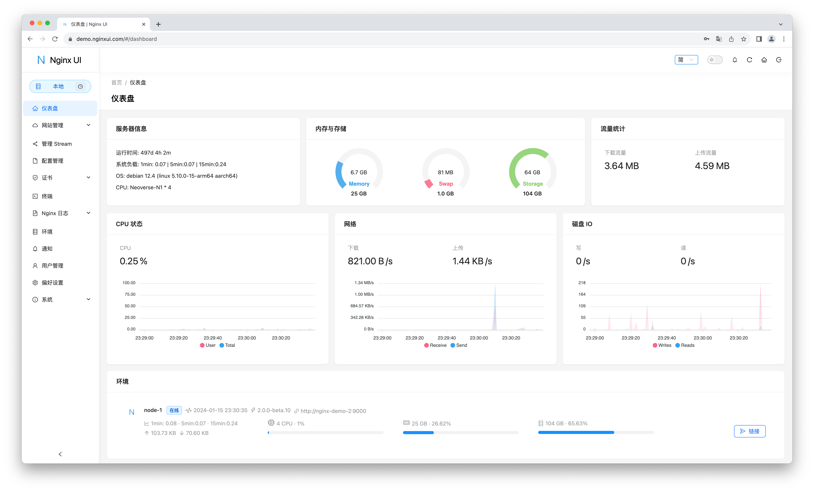

<div align="center">
      
</div>

# Nginx UI
又一个 Nginx Web UI，由 [0xJacky](https://jackyu.cn/)、[Hintay](https://blog.kugeek.com/) 和 [Akino](https://github.com/akinoccc) 开发。

[![DeepWiki](https://img.shields.io/badge/DeepWiki-0xJacky%2Fnginx--ui-blue.svg?logo=data:image/png;base64,iVBORw0KGgoAAAANSUhEUgAAACwAAAAyCAYAAAAnWDnqAAAAAXNSR0IArs4c6QAAA05JREFUaEPtmUtyEzEQhtWTQyQLHNak2AB7ZnyXZMEjXMGeK/AIi+QuHrMnbChYY7MIh8g01fJoopFb0uhhEqqcbWTp06/uv1saEDv4O3n3dV60RfP947Mm9/SQc0ICFQgzfc4CYZoTPAswgSJCCUJUnAAoRHOAUOcATwbmVLWdGoH//PB8mnKqScAhsD0kYP3j/Yt5LPQe2KvcXmGvRHcDnpxfL2zOYJ1mFwrryWTz0advv1Ut4CJgf5uhDuDj5eUcAUoahrdY/56ebRWeraTjMt/00Sh3UDtjgHtQNHwcRGOC98BJEAEymycmYcWwOprTgcB6VZ5JK5TAJ+fXGLBm3FDAmn6oPPjR4rKCAoJCal2eAiQp2x0vxTPB3ALO2CRkwmDy5WohzBDwSEFKRwPbknEggCPB/imwrycgxX2NzoMCHhPkDwqYMr9tRcP5qNrMZHkVnOjRMWwLCcr8ohBVb1OMjxLwGCvjTikrsBOiA6fNyCrm8V1rP93iVPpwaE+gO0SsWmPiXB+jikdf6SizrT5qKasx5j8ABbHpFTx+vFXp9EnYQmLx02h1QTTrl6eDqxLnGjporxl3NL3agEvXdT0WmEost648sQOYAeJS9Q7bfUVoMGnjo4AZdUMQku50McDcMWcBPvr0SzbTAFDfvJqwLzgxwATnCgnp4wDl6Aa+Ax283gghmj+vj7feE2KBBRMW3FzOpLOADl0Isb5587h/U4gGvkt5v60Z1VLG8BhYjbzRwyQZemwAd6cCR5/XFWLYZRIMpX39AR0tjaGGiGzLVyhse5C9RKC6ai42ppWPKiBagOvaYk8lO7DajerabOZP46Lby5wKjw1HCRx7p9sVMOWGzb/vA1hwiWc6jm3MvQDTogQkiqIhJV0nBQBTU+3okKCFDy9WwferkHjtxib7t3xIUQtHxnIwtx4mpg26/HfwVNVDb4oI9RHmx5WGelRVlrtiw43zboCLaxv46AZeB3IlTkwouebTr1y2NjSpHz68WNFjHvupy3q8TFn3Hos2IAk4Ju5dCo8B3wP7VPr/FGaKiG+T+v+TQqIrOqMTL1VdWV1DdmcbO8KXBz6esmYWYKPwDL5b5FA1a0hwapHiom0r/cKaoqr+27/XcrS5UwSMbQAAAABJRU5ErkJggg==)](https://deepwiki.com/0xJacky/nginx-ui)
[](https://deepwiki.com/0xJacky/nginx-ui)

[](https://nginxui.com)

<p>
  <a href="https://atomgit.com/uozi/nginx-ui" target="_blank" title="本项目是 AtomGit G-Star 计划的一部分">
    
  </a>
  &nbsp;自豪地托管于 <a href="https://atomgit.com/uozi/nginx-ui">AtomGit</a> — <b>G-Star</b> 计划成员。
</p>

[](https://atomgit.com/uozi/nginx-ui)

[](https://github.com/0xJacky/nginx-ui/actions/workflows/build.yml)
[](https://github.com/0xJacky/nginx-ui "Click to view the repo on Github")
[](https://github.com/0xJacky/nginx-ui/releases/latest "Click to view the repo on Github")
[](https://github.com/0xJacky/nginx-ui "Click to view the repo on Github")
[](https://github.com/0xJacky/nginx-ui "Click to view the repo on Github")
[](https://github.com/0xJacky/nginx-ui "Click to view the repo on Github")
[](https://github.com/0xJacky/nginx-ui/issues "Click to view the repo on Github")

[](https://hub.docker.com/r/uozi/nginx-ui "Click to view the image on Docker Hub")
[](https://hub.docker.com/r/uozi/nginx-ui "Click to view the image on Docker Hub")
[](https://hub.docker.com/r/uozi/nginx-ui "Click to view the image on Docker Hub")

[](https://hellogithub.com/repository/86f3a8f779934748a34fe6f1b5cd442f)

## 文档
请访问 [nginxui.com](https://nginxui.com) 查阅文档。

## 赞助

如果本项目对您有帮助，请考虑赞助我们，以支持持续的开发与维护。

[](https://github.com/sponsors/nginxui)
[](https://afdian.com/a/nginxui)

### 赞助商

<a href="https://www.axisnow.io/zh" target="_blank">
  
</a>

保护并加速网站与 API，兼顾中国大陆及全球的访问体验，并通过客户端 SDK，将加速与安全能力延伸至原生/移动 App — **自建私有部署 CDN｜订阅式高防 CDN｜自主可控、灵活组合的 CDN 网络。**

### 官方交流群

欢迎加入 Nginx UI 官方微信交流群，和社区用户一起交流使用经验、部署方案与问题排查。

扫描下方二维码添加好友，并备注 `Nginx UI 交流群`，管理员会邀请您加入官方交流群。

<p align="center">
  
</p>

您的支持将帮助我们：
- 🚀 加速新功能开发
- 🐛 修复缺陷并提升稳定性
- 📚 完善文档与教程
- 🌐 提供更好的社区支持
- 💻 维护基础设施与演示服务器

### 工具支持

<a href="https://www.jetbrains.com/?from=nginx-ui" target="_blank">
  
</a>

感谢 [JetBrains](https://www.jetbrains.com/?from=nginx-ui) 为我们提供免费的开源许可证支持。


## Stargazers over time

[](https://cloud.nginxui.com/stars/0xJacky/nginx-ui.svg)

[English](../../README.md) | [Español](README-es.md) | 简体中文 | [繁體中文](README-zh_TW.md) | [Tiếng Việt](README-vi_VN.md) | [日本語](README-ja_JP.md)

<details>
  <summary>目录</summary>
  <ol>
    <li>
      <a href="#关于项目">关于项目</a>
      <ul>
        <li><a href="#在线预览">在线预览</a></li>
        <li><a href="#特色">特色</a></li>
        <li><a href="#国际化">国际化</a></li>
      </ul>
    </li>
    <li>
      <a href="#入门指南">入门指南</a>
      <ul>
        <li><a href="#使用前注意">使用前注意</a></li>
        <li><a href="#安装">安装</a></li>
        <li>
          <a href="#使用方法">使用方法</a>
          <ul>
            <li><a href="#通过执行文件运行">通过执行文件运行</a></li>
            <li><a href="#使用-systemd">使用 Systemd</a></li>
            <li><a href="#使用-docker">使用 Docker</a></li>
          </ul>
        </li>
      </ul>
    </li>
    <li>
      <a href="#手动构建">手动构建</a>
      <ul>
        <li><a href="#依赖">依赖</a></li>
        <li><a href="#构建前端">构建前端</a></li>
        <li><a href="#构建后端">构建后端</a></li>
      </ul>
    </li>
    <li>
      <a href="#linux-安装脚本">Linux 安装脚本</a>
      <ul>
        <li><a href="#基本用法">基本用法</a></li>
        <li><a href="#更多用法">更多用法</a></li>
      </ul>
    </li>
    <li><a href="#nginx-反向代理配置示例">Nginx 反向代理配置示例</a></li>
    <li><a href="#贡献">贡献</a></li>
    <li><a href="#开源许可">开源许可</a></li>
  </ol>
</details>

## 关于项目



### 在线预览
网址：[https://demo.nginxui.com](https://demo.nginxui.com)
- 用户名：admin
- 密码：admin

### 特色

- 在线查看服务器 CPU、内存、系统负载、磁盘使用率等指标
- 配置修改后自动备份，支持版本对比与恢复
- 支持将操作镜像到多个集群节点，轻松管理多服务器环境
- 导出加密的 Nginx / Nginx UI 配置，便于快速部署与恢复到新环境
- 增强版在线 **ChatGPT** 助手，支持多种模型，包括 Deepseek-R1 思考链展示，帮助您更好地理解与优化配置
- **MCP**（Model Context Protocol）为 AI 代理提供专用接口，实现自动化配置管理与服务控制
- 一键申请并自动续签 Let's Encrypt 证书
- 在线编辑网站配置：自研的块状编辑器 **NgxConfigEditor**，或支持 **LLM 代码补全** 与 Nginx 语法高亮的 **Ace Code Editor**
- 在线查看 Nginx 日志
- 使用 Go 与 Vue 开发，发行版为单个可执行二进制文件
- 保存配置后自动测试配置文件并重载 Nginx
- Web 终端
- 深色模式
- 自适应网页设计

### 国际化

我们正式支持：

- 英语
- 简体中文
- 繁体中文

作为非英语母语者，我们力求准确，但仍可能有改进空间。若发现问题，欢迎反馈！

感谢社区贡献，更多语言也可使用！欢迎在 [Weblate](https://weblate.nginxui.com) 浏览并参与翻译。


## 入门指南

### 使用前注意

Nginx UI 遵循 Debian 网页服务器配置文件标准。创建的站点配置会放在 Nginx 配置目录（自动检测）下的 `sites-available` 中；启用后的站点会在 `sites-enabled` 中创建软链接。您可能需要先调整现有配置的组织方式。

对于非 Debian（及 Ubuntu）系统，可能需要将 `nginx.conf` 改为如下 Debian 风格：

```nginx
http {
	# ...
	include /etc/nginx/conf.d/*.conf;
	include /etc/nginx/sites-enabled/*;
}
```

更多信息：[debian/conf/nginx.conf](https://salsa.debian.org/nginx-team/nginx/-/blob/debian/latest/debian/conf/nginx.conf#L60-L61)

### 安装

Nginx UI 可在以下平台使用：

- macOS 11 Big Sur 及之后版本（amd64 / arm64）
- Windows 10 及之后版本（amd64 / arm64）
- Linux 2.6.23 及之后版本（x86 / amd64 / arm64 / armv5 / armv6 / armv7 / mips32 / mips64 / riscv64 / loongarch64）
  - 包括但不限于 Debian 7 / 8、Ubuntu 12.04 / 14.04 及后续版本、CentOS 6 / 7、Arch Linux
- FreeBSD
- OpenBSD
- Dragonfly BSD
- Openwrt

可在 [最新发行](https://github.com/0xJacky/nginx-ui/releases/latest) 下载，或使用 [Linux 安装脚本](#linux-安装脚本)。

### 使用方法

首次运行 Nginx UI 时，请在浏览器访问 `http://<your_server_ip>:<listen_port>` 完成后续配置。

#### 通过执行文件运行
**在终端中运行 Nginx UI**

```shell
nginx-ui -config app.ini
```
在终端按 `Control+C` 退出 Nginx UI。

**在后台运行 Nginx UI**

```shell
nohup ./nginx-ui -config app.ini &
```
使用以下命令停止 Nginx UI：

```shell
kill -9 $(ps -aux | grep nginx-ui | grep -v grep | awk '{print $2}')
```

#### 使用 Systemd
若使用 [Linux 安装脚本](#linux-安装脚本)，Nginx UI 会作为 systemd 中的 `nginx-ui` 服务安装。请使用 `systemctl` 控制。

**启动 Nginx UI**

```shell
systemctl start nginx-ui
```
**停止 Nginx UI**

```shell
systemctl stop nginx-ui
```
**重启 Nginx UI**

```shell
systemctl restart nginx-ui
```

#### 使用 Docker
我们的 Docker 镜像 [uozi/nginx-ui:latest](https://hub.docker.com/r/uozi/nginx-ui) 基于最新 nginx 镜像，可用于替代宿主机上的 Nginx。将容器的 80 与 443 端口发布到宿主机，即可轻松切换。

##### 注意
1. 首次使用时，映射到 `/etc/nginx` 的卷必须为空目录。
2. 若需托管静态文件，可将目录映射进容器。
3. 若从旧镜像升级，请参阅 [Docker WebSocket 修复指南](https://nginxui.com/zh_CN/guide/docker-websocket-fix.html) 以更新 `conf.d/nginx-ui.conf`。

<details>
<summary><b>使用 Docker 部署</b></summary>

1. [安装 Docker。](https://docs.docker.com/install/)

2. 按如下方式部署 nginx-ui：

```bash
docker run -dit \
  --name=nginx-ui \
  --restart=always \
  -e TZ=Asia/Shanghai \
  -v /mnt/user/appdata/nginx:/etc/nginx \
  -v /mnt/user/appdata/nginx-ui:/etc/nginx-ui \
  -v /var/run/docker.sock:/var/run/docker.sock \
  -p 8080:80 -p 8443:443 \
  uozi/nginx-ui:latest
```

3. 容器运行后，通过 `http://<your_server_ip>:8080/install` 登录安装向导。
   若更改了端口映射，请通过映射到容器 `80` 端口的宿主机端口访问 Nginx UI。
</details>

<details>
<summary><b>使用 Docker Compose 部署</b></summary>

1. [安装 Docker Compose。](https://docs.docker.com/compose/install/)

2. 创建如下 `docker-compose.yml`：

```yml
services:
    nginx-ui:
        stdin_open: true
        tty: true
        container_name: nginx-ui
        restart: always
        environment:
            - TZ=Asia/Shanghai
        volumes:
            - '/mnt/user/appdata/nginx:/etc/nginx'
            - '/mnt/user/appdata/nginx-ui:/etc/nginx-ui'
            - '/var/www:/var/www'
            - '/var/run/docker.sock:/var/run/docker.sock'
        ports:
            - 8080:80
            - 8443:443
        image: 'uozi/nginx-ui:latest'
```

3. 创建并启动容器：
```bash
docker compose up -d
```

4. 容器运行后，通过 `http://<your_server_ip>:8080/install` 登录安装向导。
   若更改了端口映射，请通过映射到容器 `80` 端口的宿主机端口访问 Nginx UI。

</details>

## 手动构建

在没有官方构建的平台上，可以手动构建。

### 依赖

- Make

- Golang 1.23+

- node.js 21+

  ```shell
  npx browserslist@latest --update-db
  ```

### 构建前端

请在 `app` 目录执行：

```shell
bun install
bun run build
```

### 构建后端

请先完成前端构建，再在项目根目录执行：

```shell
go generate
go build -tags=jsoniter -ldflags "$LD_FLAGS -X 'github.com/0xJacky/Nginx-UI/settings.buildTime=$(date +%s)'" -o nginx-ui -v main.go
```

## Linux 安装脚本

### 基本用法

**安装与升级**

```shell
bash -c "$(curl -L https://cloud.nginxui.com/install.sh)" @ install
```
默认监听端口为 `9000`，默认 HTTP Challenge 端口为 `9180`。
若发生端口冲突，请手动修改 `/usr/local/etc/nginx-ui/app.ini`，
然后执行 `systemctl restart nginx-ui` 重载服务。

**卸载 Nginx UI（保留配置与数据库）**

```shell
bash -c "$(curl -L https://cloud.nginxui.com/install.sh)" @ remove
```

### 更多用法

````shell
bash -c "$(curl -L https://cloud.nginxui.com/install.sh)" @ help
````

## Nginx 反向代理配置示例

```nginx
server {
    listen          80;
    listen          [::]:80;

    server_name     <your_server_name>;
    rewrite ^(.*)$  https://$host$1 permanent;
}

map $http_upgrade $connection_upgrade {
    default upgrade;
    ''      close;
}

server {
    listen  443       ssl;
    listen  [::]:443  ssl;
    http2   on;

    server_name         <your_server_name>;

    ssl_certificate     /path/to/ssl_cert;
    ssl_certificate_key /path/to/ssl_cert_key;

    location / {
        proxy_set_header    Host                $host;
        proxy_set_header    X-Real-IP           $remote_addr;
        proxy_set_header    X-Forwarded-For     $proxy_add_x_forwarded_for;
        proxy_set_header    X-Forwarded-Proto   $scheme;
        proxy_http_version  1.1;
        proxy_set_header    Upgrade             $http_upgrade;
        proxy_set_header    Connection          $connection_upgrade;
        proxy_pass          http://127.0.0.1:9000/;
    }
}
```

## 贡献

贡献使开源社区成为学习、启发与创造的绝佳场所。我们**非常感谢**您的任何贡献。

若有改进建议，欢迎 fork 本仓库并创建 Pull Request；也可以创建带有 `enhancement` 标签的 Issue。别忘了给项目点个 Star！再次感谢！

1. Fork 本项目
2. 创建功能分支（`git checkout -b feature/AmazingFeature`）
3. 提交更改（`git commit -m 'Add some AmazingFeature'`）
4. 推送到分支（`git push origin feature/AmazingFeature`）
5. 打开 Pull Request

## 开源许可

本项目基于 GNU Affero General Public License v3.0 许可，详见 [LICENSE](../../LICENSE) 文件。使用、分发或贡献本项目，即表示您同意该许可证的条款与条件。
