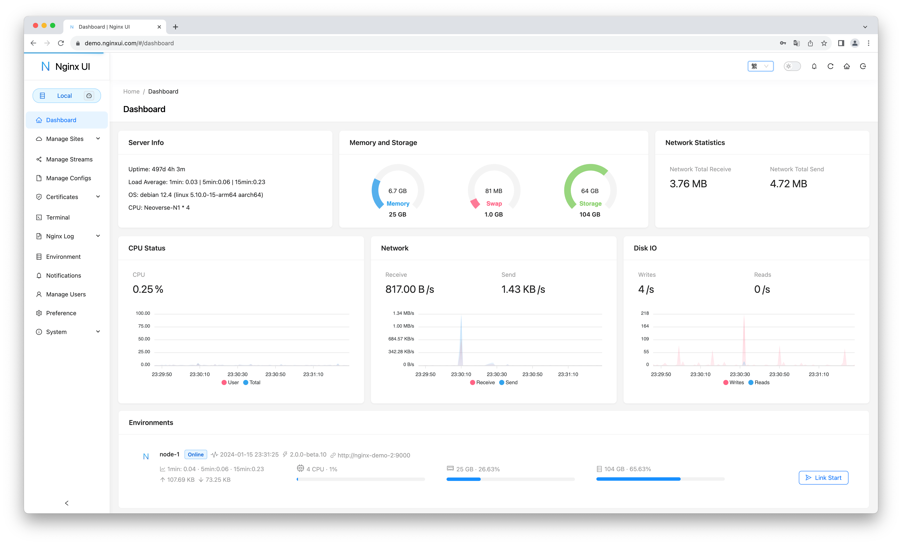

<div align="center">
      
</div>

# Nginx UI
又一個 Nginx Web UI，由 [0xJacky](https://jackyu.cn/)、[Hintay](https://blog.kugeek.com/) 和 [Akino](https://github.com/akinoccc) 開發。

[![DeepWiki](https://img.shields.io/badge/DeepWiki-0xJacky%2Fnginx--ui-blue.svg?logo=data:image/png;base64,iVBORw0KGgoAAAANSUhEUgAAACwAAAAyCAYAAAAnWDnqAAAAAXNSR0IArs4c6QAAA05JREFUaEPtmUtyEzEQhtWTQyQLHNak2AB7ZnyXZMEjXMGeK/AIi+QuHrMnbChYY7MIh8g01fJoopFb0uhhEqqcbWTp06/uv1saEDv4O3n3dV60RfP947Mm9/SQc0ICFQgzfc4CYZoTPAswgSJCCUJUnAAoRHOAUOcATwbmVLWdGoH//PB8mnKqScAhsD0kYP3j/Yt5LPQe2KvcXmGvRHcDnpxfL2zOYJ1mFwrryWTz0advv1Ut4CJgf5uhDuDj5eUcAUoahrdY/56ebRWeraTjMt/00Sh3UDtjgHtQNHwcRGOC98BJEAEymycmYcWwOprTgcB6VZ5JK5TAJ+fXGLBm3FDAmn6oPPjR4rKCAoJCal2eAiQp2x0vxTPB3ALO2CRkwmDy5WohzBDwSEFKRwPbknEggCPB/imwrycgxX2NzoMCHhPkDwqYMr9tRcP5qNrMZHkVnOjRMWwLCcr8ohBVb1OMjxLwGCvjTikrsBOiA6fNyCrm8V1rP93iVPpwaE+gO0SsWmPiXB+jikdf6SizrT5qKasx5j8ABbHpFTx+vFXp9EnYQmLx02h1QTTrl6eDqxLnGjporxl3NL3agEvXdT0WmEost648sQOYAeJS9Q7bfUVoMGnjo4AZdUMQku50McDcMWcBPvr0SzbTAFDfvJqwLzgxwATnCgnp4wDl6Aa+Ax283gghmj+vj7feE2KBBRMW3FzOpLOADl0Isb5587h/U4gGvkt5v60Z1VLG8BhYjbzRwyQZemwAd6cCR5/XFWLYZRIMpX39AR0tjaGGiGzLVyhse5C9RKC6ai42ppWPKiBagOvaYk8lO7DajerabOZP46Lby5wKjw1HCRx7p9sVMOWGzb/vA1hwiWc6jm3MvQDTogQkiqIhJV0nBQBTU+3okKCFDy9WwferkHjtxib7t3xIUQtHxnIwtx4mpg26/HfwVNVDb4oI9RHmx5WGelRVlrtiw43zboCLaxv46AZeB3IlTkwouebTr1y2NjSpHz68WNFjHvupy3q8TFn3Hos2IAk4Ju5dCo8B3wP7VPr/FGaKiG+T+v+TQqIrOqMTL1VdWV1DdmcbO8KXBz6esmYWYKPwDL5b5FA1a0hwapHiom0r/cKaoqr+27/XcrS5UwSMbQAAAABJRU5ErkJggg==)](https://deepwiki.com/0xJacky/nginx-ui)
[](https://deepwiki.com/0xJacky/nginx-ui)

[](https://nginxui.com)

<p>
  <a href="https://atomgit.com/uozi/nginx-ui" target="_blank" title="本專案是 AtomGit G-Star 計畫的一部分">
    
  </a>
  &nbsp;自豪地託管於 <a href="https://atomgit.com/uozi/nginx-ui">AtomGit</a> — <b>G-Star</b> 計畫成員。
</p>

[](https://atomgit.com/uozi/nginx-ui)

[](https://github.com/0xJacky/nginx-ui/actions/workflows/build.yml)
[](https://github.com/0xJacky/nginx-ui "Click to view the repo on Github")
[](https://github.com/0xJacky/nginx-ui/releases/latest "Click to view the repo on Github")
[](https://github.com/0xJacky/nginx-ui "Click to view the repo on Github")
[](https://github.com/0xJacky/nginx-ui "Click to view the repo on Github")
[](https://github.com/0xJacky/nginx-ui "Click to view the repo on Github")
[](https://github.com/0xJacky/nginx-ui/issues "Click to view the repo on Github")

[](https://hub.docker.com/r/uozi/nginx-ui "Click to view the image on Docker Hub")
[](https://hub.docker.com/r/uozi/nginx-ui "Click to view the image on Docker Hub")
[](https://hub.docker.com/r/uozi/nginx-ui "Click to view the image on Docker Hub")

[](https://hellogithub.com/repository/86f3a8f779934748a34fe6f1b5cd442f)

## 文件
請造訪 [nginxui.com](https://nginxui.com) 查閱文件。

## 贊助

如果本專案對您有幫助，請考慮贊助我們，以支援持續的開發與維護。

[](https://github.com/sponsors/nginxui)
[](https://afdian.com/a/nginxui)

### 贊助商

<a href="https://www.axisnow.io/zh" target="_blank">
  
</a>

保護並加速網站與 API，兼顧中國大陸及全球的存取體驗，並透過用戶端 SDK，將加速與安全能力延伸至原生／行動 App — **自建私有部署 CDN｜訂閱式高防 CDN｜自主可控、靈活組合的 CDN 網路。**

### 官方交流群

歡迎加入 Nginx UI 官方微信交流群，和社群使用者一起交流使用經驗、部署方案與問題排查。

掃描下方二維碼新增好友，並備註 `Nginx UI 交流群`，管理員會邀請您加入官方交流群。

<p align="center">
  
</p>

您的支援將幫助我們：
- 🚀 加速新功能開發
- 🐛 修復缺陷並提升穩定性
- 📚 完善文件與教學
- 🌐 提供更好的社群支援
- 💻 維護基礎設施與示範伺服器

### 工具支援

<a href="https://www.jetbrains.com/?from=nginx-ui" target="_blank">
  
</a>

感謝 [JetBrains](https://www.jetbrains.com/?from=nginx-ui) 為我們提供免費的開源軟體授權條款支援。


## Stargazers over time

[](https://cloud.nginxui.com/stars/0xJacky/nginx-ui.svg)

[English](../../README.md) | [Español](README-es.md) | [简体中文](README-zh_CN.md) | 繁體中文 | [Tiếng Việt](README-vi_VN.md) | [日本語](README-ja_JP.md)

<details>
  <summary>目錄</summary>
  <ol>
    <li>
      <a href="#關於專案">關於專案</a>
      <ul>
        <li><a href="#線上預覽">線上預覽</a></li>
        <li><a href="#特色">特色</a></li>
        <li><a href="#國際化">國際化</a></li>
      </ul>
    </li>
    <li>
      <a href="#入門指南">入門指南</a>
      <ul>
        <li><a href="#使用前注意">使用前注意</a></li>
        <li><a href="#安裝">安裝</a></li>
        <li>
          <a href="#使用方法">使用方法</a>
          <ul>
            <li><a href="#透過執行檔案執行">透過執行檔案執行</a></li>
            <li><a href="#使用-systemd">使用 Systemd</a></li>
            <li><a href="#使用-docker">使用 Docker</a></li>
          </ul>
        </li>
      </ul>
    </li>
    <li>
      <a href="#手動建置">手動建置</a>
      <ul>
        <li><a href="#相依性">相依性</a></li>
        <li><a href="#建置前端">建置前端</a></li>
        <li><a href="#建置後端">建置後端</a></li>
      </ul>
    </li>
    <li>
      <a href="#linux-安裝指令">Linux 安裝指令</a>
      <ul>
        <li><a href="#基本用法">基本用法</a></li>
        <li><a href="#更多用法">更多用法</a></li>
      </ul>
    </li>
    <li><a href="#nginx-反向代理設定範例">Nginx 反向代理設定範例</a></li>
    <li><a href="#貢獻">貢獻</a></li>
    <li><a href="#開源軟體授權條款">開源軟體授權條款</a></li>
  </ol>
</details>

## 關於專案



### 線上預覽
網址：[https://demo.nginxui.com](https://demo.nginxui.com)
- 使用者：admin
- 密碼：admin

### 特色

- 線上檢視伺服器 CPU、記憶體、系統負載、磁碟使用率等指標
- 設定修改後自動備份，支援版本對比與還原
- 支援將操作鏡像到多個叢集節點，輕鬆管理多伺服器環境
- 匯出加密的 Nginx / Nginx UI 設定，便於快速部署與還原到新環境
- 增強版線上 **ChatGPT** 助手，支援多種模型，包括 Deepseek-R1 思考鏈顯示，幫助您更好地理解與最佳化設定
- **MCP**（Model Context Protocol）為 AI 代理提供專用介面，實現自動化設定管理與服務控制
- 一鍵申請並自動續簽 Let's Encrypt 憑證
- 線上編輯網站設定：自研的區塊編輯器 **NgxConfigEditor**，或支援 **LLM 程式碼補全** 與 Nginx 語法醒目提示的 **Ace Code Editor**
- 線上檢視 Nginx 日誌
- 使用 Go 與 Vue 開發，發行版本為單一可執行二進位檔
- 儲存設定後自動測試設定檔並重新載入 Nginx
- Web 終端
- 暗黑模式
- 自適應網頁設計

### 國際化

我們正式支援：

- 英語
- 簡體中文
- 繁體中文

作為非英語母語者，我們力求準確，但仍可能有改進空間。若發現問題，歡迎回饋！

感謝社群貢獻，更多語言亦可使用！歡迎在 [Weblate](https://weblate.nginxui.com) 瀏覽並參與翻譯。


## 入門指南

### 使用前注意

Nginx UI 遵循 Debian 網頁伺服器設定檔標準。建立的網站設定會放在 Nginx 設定目錄（自動偵測）下的 `sites-available` 中；啟用後的網站會在 `sites-enabled` 中建立軟連結。您可能需要先調整現有設定的組織方式。

對於非 Debian（及 Ubuntu）系統，可能需要將 `nginx.conf` 改為如下 Debian 風格：

```nginx
http {
	# ...
	include /etc/nginx/conf.d/*.conf;
	include /etc/nginx/sites-enabled/*;
}
```

更多資訊：[debian/conf/nginx.conf](https://salsa.debian.org/nginx-team/nginx/-/blob/debian/latest/debian/conf/nginx.conf#L60-L61)

### 安裝

Nginx UI 可在以下作業系統中使用：

- macOS 11 Big Sur 及之後版本（amd64 / arm64）
- Windows 10 及之後版本（amd64 / arm64）
- Linux 2.6.23 及之後版本（x86 / amd64 / arm64 / armv5 / armv6 / armv7 / mips32 / mips64 / riscv64 / loongarch64）
  - 包括但不限於 Debian 7 / 8、Ubuntu 12.04 / 14.04 及後續版本、CentOS 6 / 7、Arch Linux
- FreeBSD
- OpenBSD
- Dragonfly BSD
- Openwrt

可在 [最新釋出](https://github.com/0xJacky/nginx-ui/releases/latest) 下載，或使用 [Linux 安裝指令](#linux-安裝指令)。

### 使用方法

第一次執行 Nginx UI 時，請在瀏覽器造訪 `http://<your_server_ip>:<listen_port>` 完成後續設定。

#### 透過執行檔案執行
**在終端中執行 Nginx UI**

```shell
nginx-ui -config app.ini
```
在終端按 `Control+C` 結束 Nginx UI。

**在背景執行 Nginx UI**

```shell
nohup ./nginx-ui -config app.ini &
```
使用以下命令停止 Nginx UI：

```shell
kill -9 $(ps -aux | grep nginx-ui | grep -v grep | awk '{print $2}')
```

#### 使用 Systemd
若使用 [Linux 安裝指令](#linux-安裝指令)，Nginx UI 會作為 systemd 中的 `nginx-ui` 服務安裝。請使用 `systemctl` 控制。

**啟動 Nginx UI**

```shell
systemctl start nginx-ui
```
**停止 Nginx UI**

```shell
systemctl stop nginx-ui
```
**重啟 Nginx UI**

```shell
systemctl restart nginx-ui
```

#### 使用 Docker
我們的 Docker 映像 [uozi/nginx-ui:latest](https://hub.docker.com/r/uozi/nginx-ui) 基於最新 nginx 映像，可用於取代宿主機上的 Nginx。將容器的 80 與 443 埠發佈到宿主機，即可輕鬆切換。

##### 注意
1. 首次使用時，對應到 `/etc/nginx` 的卷必須為空目錄。
2. 若需託管靜態檔案，可將目錄對應進容器。
3. 若從舊映像升級，請參閱 [Docker WebSocket 修復指南](https://nginxui.com/zh_TW/guide/docker-websocket-fix.html) 以更新 `conf.d/nginx-ui.conf`。

<details>
<summary><b>使用 Docker 部署</b></summary>

1. [安裝 Docker。](https://docs.docker.com/install/)

2. 按如下方式部署 nginx-ui：

```bash
docker run -dit \
  --name=nginx-ui \
  --restart=always \
  -e TZ=Asia/Shanghai \
  -v /mnt/user/appdata/nginx:/etc/nginx \
  -v /mnt/user/appdata/nginx-ui:/etc/nginx-ui \
  -v /var/run/docker.sock:/var/run/docker.sock \
  -p 8080:80 -p 8443:443 \
  uozi/nginx-ui:latest
```

3. 容器執行後，透過 `http://<your_server_ip>:8080/install` 登入安裝精靈。
   若變更了埠對應，請透過對應到容器 `80` 埠的宿主機埠存取 Nginx UI。
</details>

<details>
<summary><b>使用 Docker Compose 部署</b></summary>

1. [安裝 Docker Compose。](https://docs.docker.com/compose/install/)

2. 建立如下 `docker-compose.yml`：

```yml
services:
    nginx-ui:
        stdin_open: true
        tty: true
        container_name: nginx-ui
        restart: always
        environment:
            - TZ=Asia/Shanghai
        volumes:
            - '/mnt/user/appdata/nginx:/etc/nginx'
            - '/mnt/user/appdata/nginx-ui:/etc/nginx-ui'
            - '/var/www:/var/www'
            - '/var/run/docker.sock:/var/run/docker.sock'
        ports:
            - 8080:80
            - 8443:443
        image: 'uozi/nginx-ui:latest'
```

3. 建立並啟動容器：
```bash
docker compose up -d
```

4. 容器執行後，透過 `http://<your_server_ip>:8080/install` 登入安裝精靈。
   若變更了埠對應，請透過對應到容器 `80` 埠的宿主機埠存取 Nginx UI。

</details>

## 手動建置

在沒有官方建置的平台上，可以手動建置。

### 相依性

- Make

- Golang 1.23+

- node.js 21+

  ```shell
  npx browserslist@latest --update-db
  ```

### 建置前端

請在 `app` 目錄執行：

```shell
bun install
bun run build
```

### 建置後端

請先完成前端建置，再在專案根目錄執行：

```shell
go generate
go build -tags=jsoniter -ldflags "$LD_FLAGS -X 'github.com/0xJacky/Nginx-UI/settings.buildTime=$(date +%s)'" -o nginx-ui -v main.go
```

## Linux 安裝指令

### 基本用法

**安裝與升級**

```shell
bash -c "$(curl -L https://cloud.nginxui.com/install.sh)" @ install
```
預設監聽連接埠為 `9000`，預設 HTTP Challenge 埠為 `9180`。
若發生連接埠衝突，請手動修改 `/usr/local/etc/nginx-ui/app.ini`，
然後執行 `systemctl restart nginx-ui` 重新載入服務。

**解除安裝 Nginx UI（保留設定與資料庫）**

```shell
bash -c "$(curl -L https://cloud.nginxui.com/install.sh)" @ remove
```

### 更多用法

````shell
bash -c "$(curl -L https://cloud.nginxui.com/install.sh)" @ help
````

## Nginx 反向代理設定範例

```nginx
server {
    listen          80;
    listen          [::]:80;

    server_name     <your_server_name>;
    rewrite ^(.*)$  https://$host$1 permanent;
}

map $http_upgrade $connection_upgrade {
    default upgrade;
    ''      close;
}

server {
    listen  443       ssl;
    listen  [::]:443  ssl;
    http2   on;

    server_name         <your_server_name>;

    ssl_certificate     /path/to/ssl_cert;
    ssl_certificate_key /path/to/ssl_cert_key;

    location / {
        proxy_set_header    Host                $host;
        proxy_set_header    X-Real-IP           $remote_addr;
        proxy_set_header    X-Forwarded-For     $proxy_add_x_forwarded_for;
        proxy_set_header    X-Forwarded-Proto   $scheme;
        proxy_http_version  1.1;
        proxy_set_header    Upgrade             $http_upgrade;
        proxy_set_header    Connection          $connection_upgrade;
        proxy_pass          http://127.0.0.1:9000/;
    }
}
```

## 貢獻

貢獻使開源社群成為學習、啟發與創造的絕佳場所。我們**非常感謝**您的任何貢獻。

若有改進建議，歡迎 fork 本程式庫並建立 Pull Request；也可以建立帶有 `enhancement` 標籤的 Issue。別忘了給專案點個 Star！再次感謝！

1. Fork 本專案
2. 建立功能分支（`git checkout -b feature/AmazingFeature`）
3. 提交變更（`git commit -m 'Add some AmazingFeature'`）
4. 推送到分支（`git push origin feature/AmazingFeature`）
5. 開啟 Pull Request

## 開源軟體授權條款

本專案基於 GNU Affero General Public License v3.0 授權條款，詳見 [LICENSE](../../LICENSE) 檔案。使用、散佈或貢獻本專案，即表示您同意該授權條款的條款與條件。
